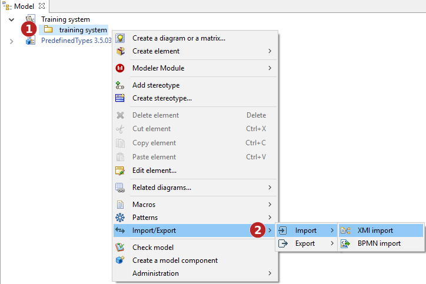
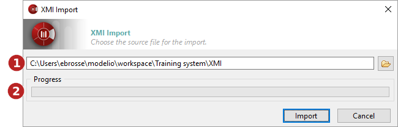

// Disable all captions for figures.
:!figure-caption:
// Path to the stylesheet files
:stylesdir: .

= Importing a model in XMI format

===== Introduction

The Modelio XMI import operation is used to import a UML2 model into Modelio from an XMI file.

The "XMI Import" command can only be run on packages. Imported elements will be located in the selected package.

.The XMI Import command

*Keys:*

1. Right-click on a package to open the context menu.
2. Run the "Import/Export \ Import \ XMI Import" command.

===== The "XMI Import" window

.The XMI import window

*Keys:*

1. This field is where you select the path of the XMI file that you are about to import.
2. This progress bar shows the progress of the import operation.

