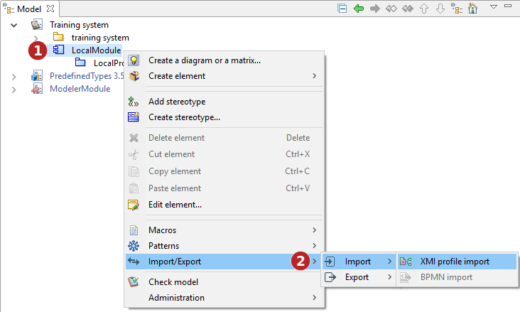
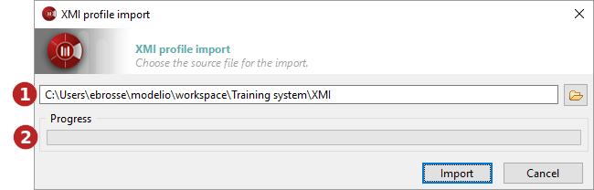

// Disable all captions for figures.
:!figure-caption:
// Path to the stylesheet files
:stylesdir: .

[[Importing-a-profile-in-XMI-format]]

[[importing-a-profile-in-xmi-format]]
= Importing a profile in XMI format

[[Introduction]]

[[introduction]]
===== Introduction

The Modelio import profile operation is used to import a UML2 profile into Modelio from an XMI file.

The "Profile import" command can only be run on modules. Imported elements will be located in the selected module.

[[The-XMI-Import-profile-command]]

[[the-xmi-import-profile-command]]
The XMI Import profile command

*Keys:*

1. Right-click on a module to open the context menu.
2. Run the "Import/Export \ Import \ Profile export" command.

[[The-ldquoXMI-profile-importrdquo-window]]

[[the-xmi-profile-import-window]]
===== The "XMI profile import" window

[[The-XMI-profile-import-window]]

[[the-xmi-profile-import-window-1]]
The XMI profile import window

*Keys:*

1. This field is where you select the path of the XMI file that you are about to import.
2. This progress bar shows the progress of the import operation.

