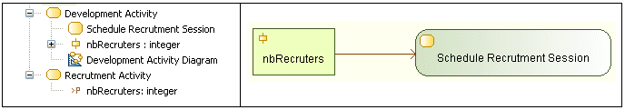

// Disable all captions for figures.
:!figure-caption:
// Path to the stylesheet files
:stylesdir: .

[[R1040]]

[[r1040]]
= R1040

[[Summary]]

[[summary]]
===== Summary

An ActivityParameterNode must represent a BehaviorParameter from the same containing Activity.

[[Details]]

[[details]]
===== Details

In this example, the "nbRecruter" ActivityParameterNode is invalid because it represents a BehaviorParameter from another activity.

[[Tips]]

[[tips]]
===== Tips

When you get a R1040 error, you can either:

* Replace the BehaviorParameter represented by the ActivityParameterNode by a BehaviorParameter contained in the same Activity that contains the ActivityParameterNode.
* Move the represented BehaviorParameter to the Activity that contains the ActivityParameterNode.

