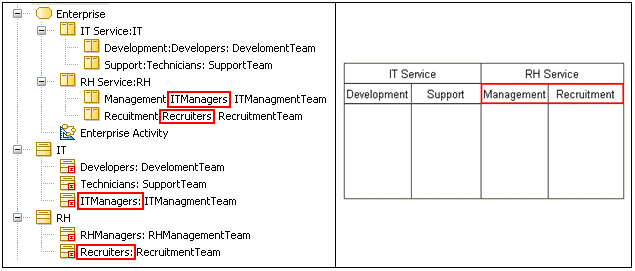

// Disable all captions for figures.
:!figure-caption:

[[R1080]]

[[r1080]]
= R1080

[[Summary]]

[[summary]]
===== Summary

The _Parts_ represented by "sibling" _ActivityPartitions_ must be _Parts_ of the same _Classifier_.

[[Details]]

[[details]]
===== Details

If an _ActivityPartition_ represents a _Part_ of a _Classifier_, then all the non-external _ActivityPartitions_ in the same dimension and at the same level of nesting in that dimension must represent _Parts_ directly contained in the internal structure of the same _Classifier_.

Example:

The rule is invalid for the "RH Service" _ActivityPartition_, because it contains _ActivityPartitions_ which represent _Parts_ of different _Classifiers_.

[[Tips]]

[[tips]]
===== Tips

Getting an R1080 error indicates an inconsistency between the organization of the _ActivityPartitions_ and the structure of the _Parts_ they represent. The solution usually implies the reorganization of the _ActivityPartitions_ to respect the design expressed by the structure of the represented _Parts_, or the modification of the design of the represented _Parts_ so they respect the responsibility scheme expressed by the organization of the _ActivityPartitions_.

