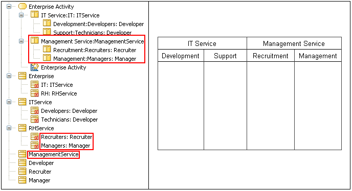

// Disable all captions for figures.
:!figure-caption:
// Path to the stylesheet files
:stylesdir: .

= R1100

===== Summary

If an _ActivityPartition_ represents a _Part_ and is contained in a super _ActivityPartition_, then the super _ActivityPartition_ must represent a _Classifier_ containing the _Part_ or a _Part_ that instanciates that _Classifier_.

===== Details

If an _ActivityPartition_ represents a _Part_ and is contained by another _ActivityPartition_, then the _Part_ must be of a _Classifier_ represented by the containing _ActivityPartition_, or of a _Classifier_ that is the type of a _Part_ represented by the containing _ActivityPartition_.

Example:

* Both the "Development" (representing "Developers") and "Support" (representing "Technicians") _ActivityPartitions_ are valid because their super _ActivityPartition_ "IT Service" represents a _Part_ that is typed by the "ITService" _Classifier_, which contains "Developers" and "Technicians".
* The "Recruitment" (representing "Recruiters") and "Management" (representing "Managers") _ActivityPartitions_ are invalid because their super _ActivityPartition_ represents the _Classifier_ "ManagementService", which does not contain the "Recruiters" and "Managers" _Parts_.

===== Tips

Getting an R1100 error indicates an inconsistency between the organization of the _ActivityPartitions_ and the structure of the _Classifiers_ and _Parts_ they represent. 
The solution usually implies the reorganization of the_ ActivityPartitions_ to respect the design expressed by the structure of the represented _Classifiers_ and _Parts_, or the modification of the design of the represented _Classifiers_ and _Parts_ so they respect the responsibility scheme expressed by the organization of the _ActivityPartitions_.

