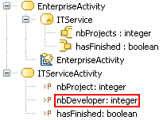

// Disable all captions for figures.
:!figure-caption:

[[R1110]]

[[r1110]]
= R1110

[[Summary]]

[[summary]]
===== Summary

_Pins_ of a _CallBehaviorAction_ must match the called _Behaviour_'s _BehaviorParameters_.

[[Details]]

[[details]]
===== Details

* The number of _InputPins_ and the number of _BehaviorParameters_ of type "_in"_ and "_inout"_ of the _Behaviour_ must be equal.
* The number of _OutputPins_ and the number of return _BehaviorParameters_ and _BehaviorParameters_ of type "_out"_ and "_inout"_ of the _Behaviour_ must be equal.

_Example:_

The _CallBehaviorAction_ "*ITService*" is invalid because the _BehaviorParameter_ "*nbDevelopers*" of the called _Activity_ "*ITServiceActivity*" is not matched to one of its _Pins_.

[[Tips]]

[[tips]]
===== Tips

* _BehaviorParameters_ that are valued by a constant may be

represented by a _ValuePin_ rather than a simple _InputPin_.

* _BehaviorParameters_ of type "_inout_" must be represented by both an _InputPin_ for the "_in_" aspect and an _OutputPin_ for the "_out_" aspect.
* Return _BehaviorParameters_ must be represented by an _OutputPin_.

