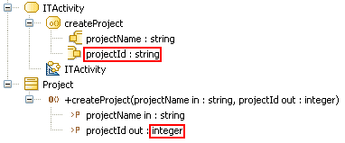

// Disable all captions for figures.
:!figure-caption:
// Path to the stylesheet files
:stylesdir: .

[[R1130]]

[[r1130]]
= R1130

[[Summary]]

[[summary]]
===== Summary

The type or the maximum multiplicity of a pin belonging to a CallOperationAction does not match its matched parameter.

[[Details]]

[[details]]
===== Details

_UML constraint_: The type, ordering, and multiplicity of an argument or result pin are derived from the corresponding owned parameter of the operation.

Example:

The Project CallOperationAction is invalid because the type of its projectId pin does not match the parameter type it is matched with.

[[Tips]]

[[tips]]
===== Tips

When you get a R1130 error, you can resolve it by doing one of the following:

* Change the type or the maximum multiplicity of one of the concerned parameters.
* Change the type or the maximum multiplicity of one of the concerned pins.

