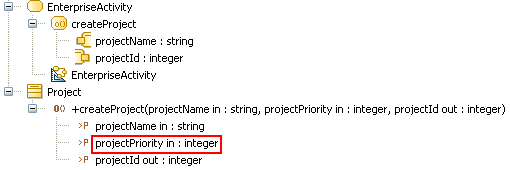

// Disable all captions for figures.
:!figure-caption:
// Path to the stylesheet files
:stylesdir: .

= R1140

===== Summary

Pins of the CallOperationAction do not match the operations parameters.

===== Details

_UML constraints_:

* The number of argument pins and the number of owned parameters of type _in_ and _in-out_ belonging to the operation must be equal.
* The number of result pins and the number of owned parameters of type _return_, _out_, and _in-out_ belonging to the operation must be equal.

Example:

The createProject CallOperationAction is invalid, because the projectPriority parameter of the createProject operation that it calls is not matched to one of its pins.

===== Tips

When you get a R1140 warning on a CallOperationAction you can resolve it by doing one of the following:

* Remove any unmatched parameters from the called operation or match it to an unmatched pin of the calling action.
* Remove any unmatched pins from the calling action or match it with any unmatched parameter of the called operation.

