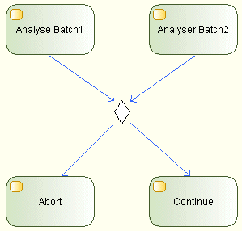
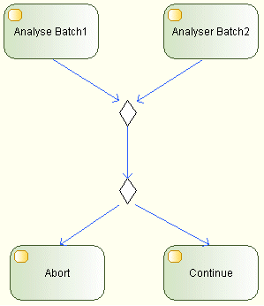

// Disable all captions for figures.
:!figure-caption:
// Path to the stylesheet files
:stylesdir: .

= R1190

===== Summary

A DecisionMerge node should be used either as a Decision node or as a Merge node.

===== Details

Although Modelio uses the same symbol to represent a Decision node and a Merge node, this DecisionMerge node should not be used in both configurations at the same time.

Here is an example of a DecisionMerge used in both configurations at the same time:

This is the correct way of doing this:

In the second diagram, we can easily express that the first DecisionMerge node is selecting the largest Batch, while the second DecisionMerge node is making a decision based on the analysis of the selected batch. This would have been hard to express in the first diagram.

===== Tips

When you get a R1190 warning, break your DecisionMerge node into two different DecisionMerge nodes, one node being a Decision node and another node being a Merge node.

