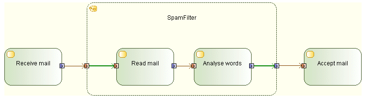

// Disable all captions for figures.
:!figure-caption:

[[R1360]]

[[r1360]]
= R1360

[[Summary]]

[[summary]]
===== Summary

Input pins may have outgoing edges only when they are on actions that are structured nodes, and these edges must target a node contained by the structured node.

[[Details]]

[[details]]
===== Details

_UML constraint_: Input pins may have outgoing edges only when they are on actions that are structured nodes, and these edges must target a node contained by the structured node.

Example:

[[Tips]]

[[tips]]
===== Tips

When you get a R1360 error, verify that what you want to achieve is a configuration as in the example above. If this is the case, make sure the incriminated InputPin only has outgoing object flows towards Nodes which are inside the StructuredNode.

