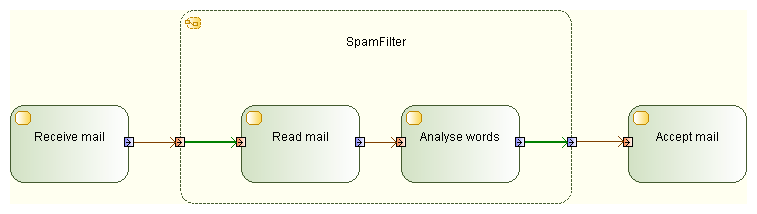

// Disable all captions for figures.
:!figure-caption:

[[R1370]]

[[r1370]]
= R1370

[[Summary]]

[[summary]]
===== Summary

_OutputPins_ may have incoming edges only when they are on _StructuredNodes_,

and these edges must have a source node contained by the _StructuredNode_.

[[Details]]

[[details]]
===== Details

_OutputPins_ may have incoming edges only when they are on _StructuredNodes_, and these edges must have a source node contained by the _StructuredNode_.

Example:

[[Tips]]

[[tips]]
===== Tips

When you get an R1370 error, verify that what you want to achieve is a configuration as in the example below. If this is the case, make sure the incriminated _OutputPin_ only has incoming object flows from Nodes which are inside the _StructuredNode_.

