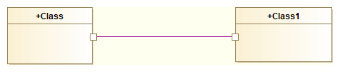
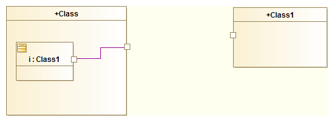

// Disable all captions for figures.
:!figure-caption:
// Path to the stylesheet files
:stylesdir: .

[[R2510]]

[[r2510]]
= R2510

[[Summary]]

[[summary]]
===== Summary

There cannot be any direct _Connectors_ between two _Class_ _Ports_.

[[Details]]

[[details]]
===== Details

The following is not allowed:

The UML specification states:

The ConnectableElements attached as roles to each ConnectorEnd owned by a Connector must be roles of the Classifier that owned the Connector, or they must be ports of such roles.

[[Tips]]

[[tips]]
===== Tips

Do this instead:

