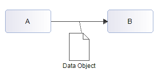
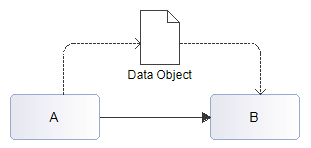

// Disable all captions for figures.
:!figure-caption:
// Path to the stylesheet files
:stylesdir: .

= R3290

===== Summary

A _SequenceFlow_ must exist to support _DataAssociations_.

===== Details

In BPMN, two ways of transfering _DataObject_ exist:

Making the _SequenceFlow_ explicitely carry the _DataObject_ through a visual shortcut ;

Directly using _DataAssociations_;

In both cases, the _SequenceFlow_ existence is mandatory.

===== Tips

Create a _SequenceFlow_ between the _BPMN elements_ transfering a _DataObject_ through _DataAssociations_.

