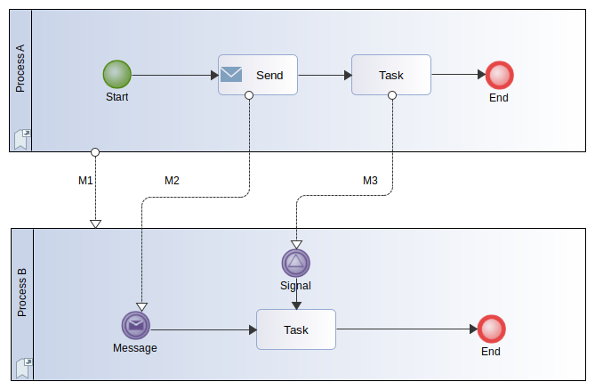
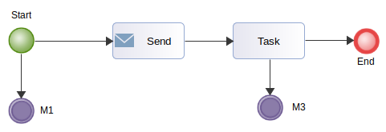

// Disable all captions for figures.
:!figure-caption:
// Path to the stylesheet files
:stylesdir: .

[[R3320]]

[[r3320]]
= R3320

[[Summary]]

[[summary]]
===== Summary

A _MessageFlow_ should start from a _SendTask/ThrowEvent/ "external" Participant_ and end on a _ReceiveTask/CatchEvent/ "external" Participant_.

[[Details]]

[[details]]
===== Details

The idea behind this recommendation is that the user reading the model should always be able to understand how a process interacts (or not) with other processes (message flows). +
While things are clear in a Collaboration Diagram where message flows are directly displayed, they are less obvious when considering a Process Diagram, where message flows do not appear. When looking at a Process diagram the user has no clue about the interactions occurring with other processes. The BPMN norm just does not provide such clues. In order to improve process diagrams readability and usability, the R3320 rule, as a tip, recommends to introduce Throw/Catch events nodes in the processes involved in a collaboration in some circumstances.

The recommended way to represent messages between _Processes_ is either to:

* Start from a _ThrowEvent_ or from a _External Participant_ and end on either a _CatchEvent_, a _ReceiveTask_ or an _External Participant_.
* Start from a _SendTask_ or from a _External Participant_ and end on either a _ReceiveTask_ or an _External Participant_.

Obviously, so called "external" Participants, that represent processes for which no internal details (Tasks) are known, remain allowed as source or target of a _MessageFlow_.

[[Tips]]

[[tips]]
===== Tips

If you have flows binding other kind of elements, you should consider updating your model to use these elements instead.

Let's discuss a simple example and how to fix it.

[[Example]]

[[example]]
===== Example

[[The-initial-Collaboration-diagram]]

[[the-initial-collaboration-diagram]]
The initial Collaboration diagram

The image below shows a collaboration diagram between two processes A and B where the three message flows M1, M2, M3 are perfectly conform to the BPMN norm.

[[The-initial-Process-diagram-of-Process-A]]

[[the-initial-process-diagram-of-process-a]]
The initial Process diagram of *Process A*

When looking at the diagram of *Process A* the user can only see the following image:

image::images/Modeler_audit_rules_R3320_ProcessA1.png[2]

The difficulty here is that the user has no clue about the fact that process A is currently interacting with another process, this can be a problem.

In our example, the R3320 audit rule will complain about M1 and M3 message flows and will not report anything about M2 as the user can infer from the nature of the "Send" SendTask that "something" is actually sent.

For the M1 and M3 message flows, which are sourced from the "Process A" _Participant_ and the "task" _Task_ in the collaboration diagram, the rule will recommend to fix the model.

[[Fixing-the-example-model-for-M1-and-M3]]

[[fixing-the-example-model-for-m1-and-m3]]
===== Fixing the example model for M1 and M3

The fix consists in inserting Throw/Catch paired events in process A and process B and using them as source/target for the M1 and M3 message flows. The images below show the fixed diagrams.

[[Fixed-Process-A-diagram]]

[[fixed-process-a-diagram]]
Fixed Process A diagram

[[Fixed-Collaboration-diagram]]

[[fixed-collaboration-diagram]]
Fixed Collaboration diagram

image::images/Modeler_audit_rules_R3320_Collaboration2.png[3]

*Conclusion:* The main benefit of the fix is that the Process A process diagram alone can now be fully understood as the M1 and M3 message flows sources appear in it, indicating that some event is propagated outside of Process A. The user reading the model is therefore invited to consider the Collaboration diagram where M1 and M3 appear explicitly.

