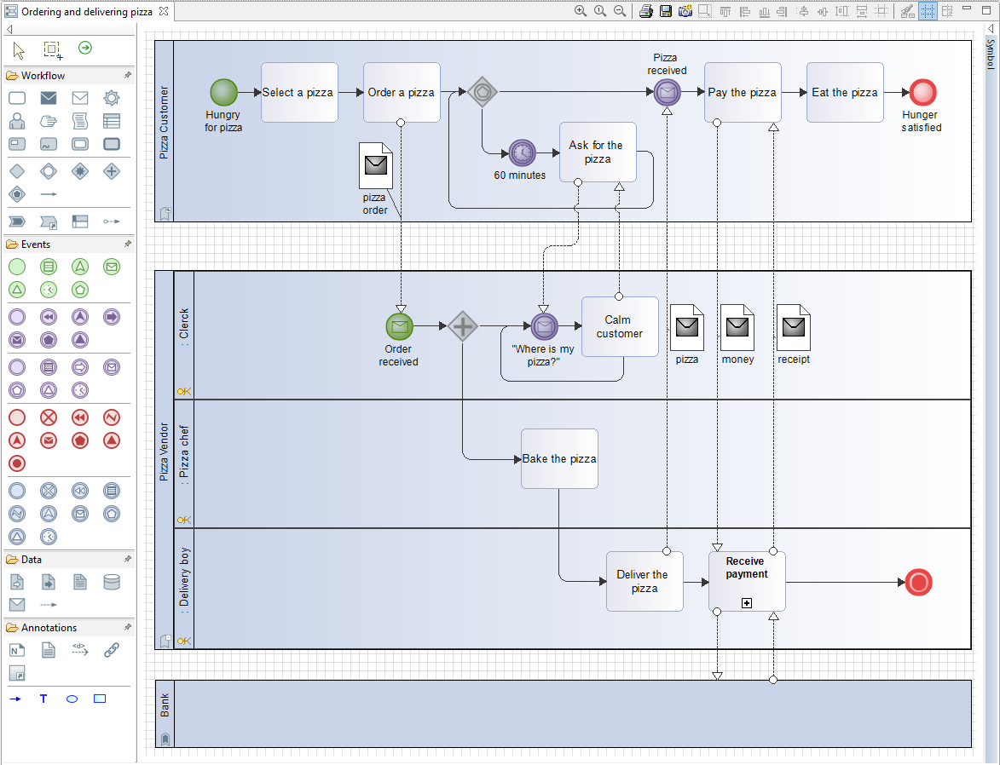

// Disable all captions for figures.
:!figure-caption:
// Path to the stylesheet files
:stylesdir: .

=  Diagramme de Collaboration image:images/attachment/bpmn41/User_Documentation_fr/BPMN_Diagrams/Collaboration_diagram/WebHome/bpmncollaborationdiagram.png[bpmncollaborationdiagram.png]

Les diagrammes de Collaboration BPMN sont attachés aux Collaborations BPMN qui sont structurés sous les Packages et les Processus BPMN.

Les diagrammes de Collaboration BPMN sont dédiés à la modélisation des interactions entre processus, représentées par des Message Flows.

Dans un diagramme de Collaboration les processus sont représentés par des Participants, qui peuvent être de 3 types :

 Participant/Processus local : ce type de Participant référence un Processus qui possède la Collaboration, et est donc "local" à la Collaboration. Il est donc éditable directement dans le diagramme de collaboration.

image:images/attachment/bpmn41/User_Documentation_fr/BPMN_Diagrams/Collaboration_diagram/WebHome/referencedprocess.png[referencedprocess.png] Participant/Processus référencé : ce type de Participant référence un Processus qui ne possède pas la Collaboration et est donc "à l'extérieur" de la Collaboration. Il n'est donc pas éditable directement dans le diagramme de collaboration. Pour éditer le contenu de ce Participant il faut éditer le diagramme de processus associé au Processus qu'il référence (en utilisant la commande contextuelle 'Diagram liés...' sur le Participant pour y naviguer directement).

image:images/attachment/bpmn41/User_Documentation_fr/BPMN_Diagrams/Collaboration_diagram/WebHome/externalparticipant.png[externalparticipant.png] Participant/Processus externe : ce type de Participant ne référence aucun Processus et est donc "externe" au modèle. Il n'a donc pas de contenu éditable.

=== Exemple "Pizza Collaboration"

.Diagramme de collaboration "Pizza Collaboration".

Dans ce diagramme de Collaboration les 3 types de Participant sont représentés :

- "Pizza Vendor" est un participant local, référençant le Processus "Pizza Vendor" qui détient la Collaboration "Pizza Collaboration".

- "Pizza Customer" est un participant référencé, référençant le Processus "Pizza Customer" qui est situé ailleurs dans le modèle.

- "Bank" est un participant externe ne référençant aucun Processus.

== Message Flows

Le but principal des diagrammes de Collaboration est de modéliser les interactions entre les processus. Pour cela il faut utiliser des Message Flows.

Les Messages Flows peuvent être tracés entre des Tâches, des Sous-Processus et des Événements qui appartiennent à des Participants différents ou des entre des Participants.

N.B: La suppression d'éléments liés par des Message Flows fera apparaitre une boite de confirmation.

=== Assistant de création de Message Flows

L'interaction IHM de création de MessageFlow entre deux éléments doit s'adapter aux deux modes de représentation et la nature externe ou non des participants source et cible du MessageFlow.

* En mode d'affichage 'Simple' des participants, Modelio propose une fenêtre avec la liste des éléments de process source et cible compatibles

* En mode d'affichage 'Structuré' des participants, Modelio permet de relier directement les deux éléments source et cible.

* En cas de situation hybride (source ou cible dans des participants affichés dans deux modes différents), Modelio propose à la fois la fenêtre de sélection pour l'élément non visualisé et l'interaction graphique directe pour celui qui est visible (participant en mode détaillé).

* Pour les participants externes, aucune assistance particulière ne peut évidemment être apportée.

.Assistant de création de Message Flow.
image::images/attachment/bpmn41/User_Documentation_fr/BPMN_Diagrams/Collaboration_diagram/WebHome/MessageFlowDefinition.png[MessageFlowDefinition.png]

