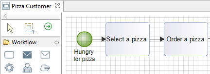

// Disable all captions for figures.
:!figure-caption:

= Création de workflow avancée

== Création de sequence flow

[[HModelien]]
=== Mode lien

L'outil de création de _BpmnSequenceFlow_ conserve le fonctionnement actuel lorsque il est utilisé entre deux éléments de workflow. Par exemple, d'un tâche à une autre, la création est directe.

[[HModeE9lE9ment]]
=== Mode élément

Si l'outil de création est utilisé entre un élément origine et le fond du diagramme ou le fond d'une _BpmnLane_, un menu s'ouvre pour créer un nouvel élément ( _BpmnTask_, _BpmnEvent_...) en tant que cible du nouveau lien.

Par exemple : en partant d'une tâche faisant partie d'une Lane, et en faisant un clic droit au fond de la même Lane, il est possible de choisir de créer une tâche dans la Lane cible, ainsi que le _BpmnSequenceFlow_ la reliant à la tâche d'origine.

.Création d'un élément depuis un lien an utilisant le clic droit ou la touche CTRL.
image::images/attachment/bpmn41/User_Documentation_fr/BPMN_Diagrams/Creation_de_workflow_avancee/NodeCreation1.png[NodeCreation1.png]

[[HInsertionden153uddeworkflow]]
== Insertion de nœud de workflow

Créer un élément de workflow ( _BpmnTask_, _BpmnGateway_...) sur un _BpmnSequenceFlow_ *F* va intercaler le nœud créé dans la séquence :

* un _BpmnSequenceFlow_ est créé entre la source de *F* et le nouvel élément ;
* un autre _BpmnSequenceFlow_ est créé entre le nouvel élément et la destination du lien *F.*

image::images/attachment/bpmn41/User_Documentation_fr/BPMN_Diagrams/Creation_de_workflow_avancee/TaskInsertion1.png[TaskInsertion1.png]

.Insertion de tâche sur un Sequence Flow

[[HInsertiondeDataObject]]
== Insertion de Data Object

Créer un _BpmnDataObject_ sur un _BpmnSequenceFlow_ *F* va créer le modèle correspondant à une transmission de données supportée par ce flux :

* un _BpmnDataAssociation_ est créé entre la source de *F* et le _BpmnDataObject_ créé ;
* un autre _BpmnDataAssociation_ est créé entre le _BpmnDataObject_ et la destination du lien *F* ;
* un _BpmnSequenceFlowDataAssociation_ est créé entre le _BpmnDataObject_ et F.

image::images/attachment/bpmn41/User_Documentation_fr/BPMN_Diagrams/Creation_de_workflow_avancee/DataAssociation1.png[DataAssociation1.png] 
.Insertion d'un Data Object sur un Sequence Flow.
image::images/attachment/bpmn41/User_Documentation_fr/BPMN_Diagrams/Creation_de_workflow_avancee/DataAssociation2.png[DataAssociation2.png]

[[HCrE9ationdepairesd27E9vE9nementsThrow2FCatch]]
== Création de paires d'événements Throw/Catch

Créer un _BpmnIntermediateCatchEvent_ ou un _BpmnIntermediateThrowEvent_ sur un _BpmnSequenceFlow_ *F* va insérer une rupture dans la séquence, souvent utilisée pour faciliter la lisibilité d'un processus :

* un _BpmnSequenceFlow_ est créé entre la source de *F* et un _BpmnIntermediateThrowEvent ;_
* un autre _BpmnSequenceFlow_ est créé entre un _BpmnIntermediateCatchEvent_ et la cible de *F* _;_
* le _BpmnIntermediateCatchEvent_ et le _BpmnIntermediateThrowEvent_ sont reliés l'un à l'autre dans le modèle.

*Note :* quand des Throw/Catch events sont reliés, la sélection de l'un dans le diagramme affiche un lien vers l'autre élément.

image::images/attachment/bpmn41/User_Documentation_fr/BPMN_Diagrams/Creation_de_workflow_avancee/ThrowLinkInsertion1.png[ThrowLinkInsertion1.png] 
.Insertion d'événements Throw/Catch
image::images/attachment/bpmn41/User_Documentation_fr/BPMN_Diagrams/Creation_de_workflow_avancee/ThrowLinkInsertion2.png[ThrowLinkInsertion2.png]

