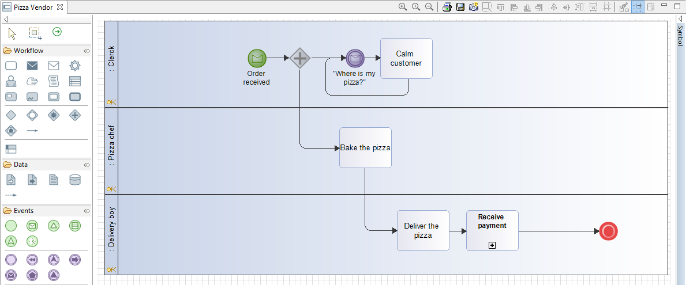

// Disable all captions for figures.
:!figure-caption:

=  Diagramme de Processus 

Les diagrammes de processus BPMN sont dédiés à la modélisation des processus, ils sont attachés aux processus.

[[HExemple22PizzaVendor22]]
=== Exemple "Pizza Vendor"

.Diagramme de processus "Pizza Vendor"

Ce diagramme de processus attaché au processus "Pizza Vendor" détaille le fonctionnement du processus.