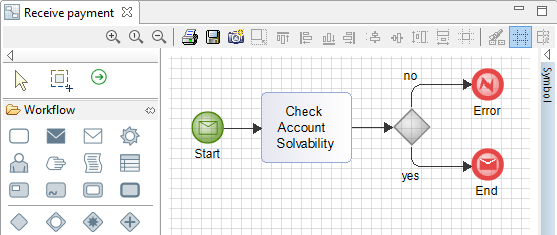

// Disable all captions for figures.
:!figure-caption:
// Path to the stylesheet files
:stylesdir: .

=  Diagramme de Sous-Processus 

Les diagrammes de sous-processus BPMN sont utilisés pour modéliser des processus au niveau des sous-processus BPMN.

=== Exemple "Receive Payment"

.Exemple de diagramme de sous-processus "Receive Payment"

Les diagrammes de sous-processus peuvent aussi être rendu visibles dans les autres diagrammes BPMN en cochant l'option 'Afficher le contenu' de la vue Symbol du Sous-Processus :

.Sous-processus réduit
image::images/attachment/bpmn41/User_Documentation_fr/BPMN_Diagrams/SubProcess_diagram/WebHome/Sub-ProcessShowContent1.png[Sub-ProcessShowContent1.png]

.Sous-processus développé
image::images/attachment/bpmn41/User_Documentation_fr/BPMN_Diagrams/SubProcess_diagram/WebHome/Sub-ProcessShowContent2.png[Sub-ProcessShowContent2.png]

