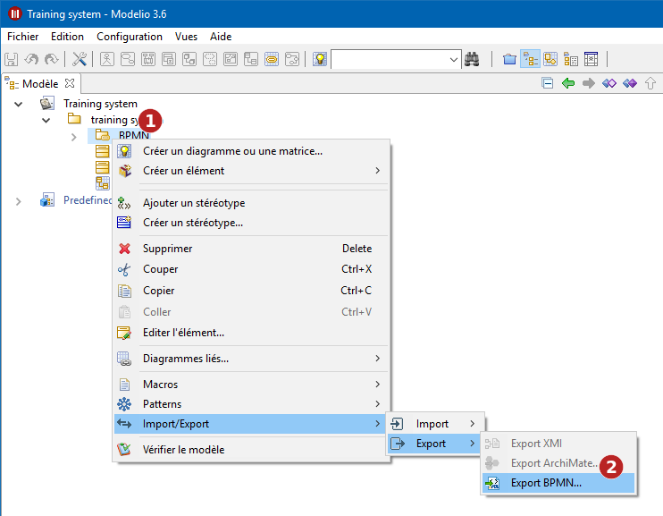
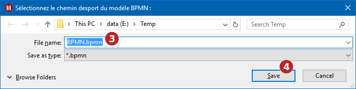

// Disable all captions for figures.
:!figure-caption:
// Path to the stylesheet files
:stylesdir: .

= Exporter un modèle BPMN

== Introduction

Le service d'export BPMN permet de générer un fichier *.bpmn à partir d'un modèle BPMN modélisé avec Modelio.

Pour exporter un modèle BPMN, vous devrez :

1.  Sélectionner le modèle BPMN à exporter dans l'explorateur du projet.
2.  Utiliser la commande contextuelle *Import / Export > Export > Export BPMN*.

.Exporter un modèle BPMN

*Étapes :*

1.  Sélectionner le modèle BPMN à exporter.
2.  Lancer la commande *Import / Export > Export > Export BPMN*.
3.  Choisir le nom du fichier exporté.
4.  Cliquer sur *Enregistrer* pour valider l'export.

*Note :* Certains modèles BPMN peuvent avoir besoin d'être normalisés avant l'export. Vérifiez que votre modèle est en lecture-écriture avant de lancer la commande.

