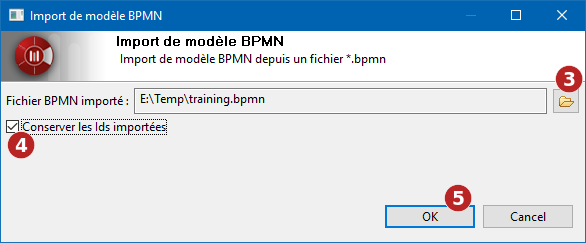
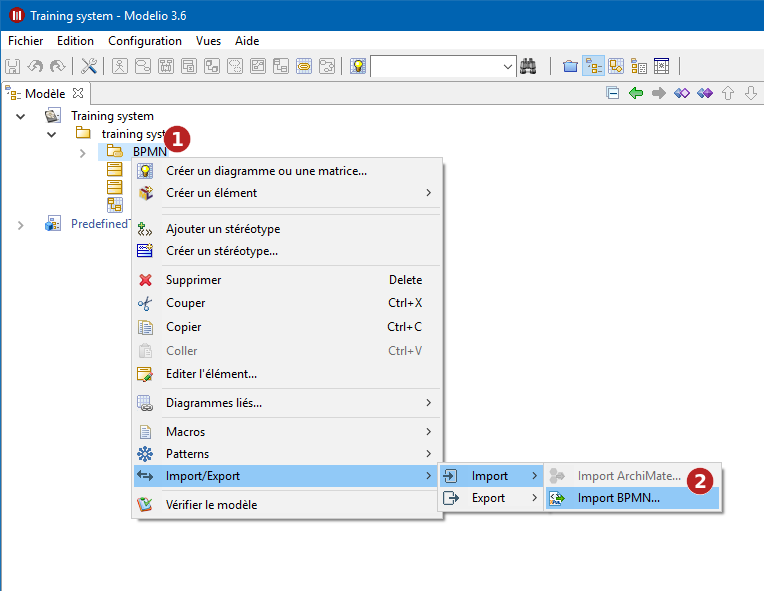

// Disable all captions for figures.
:!figure-caption:

[[Importer-un-Modèle-BPMN]]

[[importer-un-modèle-bpmn]]
= Importer un Modèle BPMN

[[Introduction]]

[[introduction]]
===== Introduction

Le service d'import BPMN de Modelio permet d'importer un modèle BPMN à partir d'un fichier _.bpmn. Il permet aussi de mettre à jour un modèle existant à partir d'un fichier_.bpmn mis à jour.

Pendant le processus d'import, vous pouvez choisir de conserver les ID des éléments BPMN déclarés dans le fichier importé, ou encore choisir de générer de nouveaux ID Modelio. Dans le cas où vous choisiriez de conserver les ID d'origine, vous devez vous assurer que ceux-ci sont uniques. Dans le cas contraire, vous vous exposerez à des erreurs inattendues lors du processus d'import.

[[Importer-un-Modèle-BPMN-2]]

[[importer-un-modèle-bpmn-1]]
===== Importer un Modèle BPMN

Pour importer un modèle BPMN depuis un fichier, vous devrez :

* Sélectionner un package racine dans l'explorateur de projet.
* Utiliser la commande contextuelle *Import/Export > Import > Import BPMN*.

image::images/Import_BPMN_bpmn_import_1_FR.png[image]
.Import BPMN

*Étapes :*

1. Cliquez sur le package racine du modèle de travail +
2. Exécutez la commande *Import/Export > Import > BPMN Import* +
3. Parcourez le disque ou le réseau pour sélectionner le fichier bpmn à importer +
4. Indiquez si vous souhaitez ou non conserver les identifiants des éléments importés +
5. Cliquez sur *OK* pour valider et démarrer l'import

[[Mettre-à-jour-un-modèle-BPMN]]

[[mettre-à-jour-un-modèle-bpmn]]
===== Mettre à jour un modèle BPMN

Pour mettre à jour un modèle BPMN existant à partir d'un fichier *.bpmn modifié, vous devrez :

* Sélectionner le processus BPMN (image:images/Import_BPMN_bpmnbehavior.png[image]) à mettre à jour dans l'explorateur du projet.
* Utiliser la commande contextuelle *Import/Export > Import > Import BPMN*.

.Mise à jour d'un modèle BPMN

*Étapes :*

1. Cliquez sur la racine du BPMN behavior image:images/Import_BPMN_bpmnbehavior.png[image]
2. Exécutez la commande *Import/Export > Import > BPMN Import*
3. Parcourez le disque ou le réseau pour sélectionner le fichier bpmn à importer 
4. Indiquez si vous souhaitez ou non conserver les identifiants des éléments importés 
5. Cliquez sur *OK* pour valider et démarrer la mise à jour

