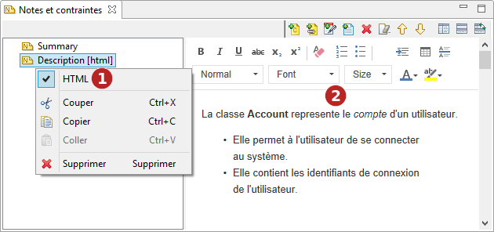

// Disable all captions for figures.
:!figure-caption:
// Path to the stylesheet files
:stylesdir: .

= Ajouter des notes / contraintes aux éléments

Il existe deux moyens d'ajouter des notes ou contraintes aux éléments :

* En utilisant les icônes "Créer une note" ou "Créer une contrainte" dans la palettes des diagrammes.
* En utilisant les vues <<Modeler-_modeler_interface_properties_view.adoc#,Propriétés>> ou <<Modeler-_modeler_interface_annot_view.adoc#,Notes & contraintes>> sur l'élément en question.

.Ajout d'une note à une classe dans la vue "Notes & contraintes"
image::images/Modeler-_modeler_building_models_add_notes_modifelements_003.png[2]

*Étapes :*

1.  Sélectionnez l'élément auquel vous voulez ajouter une note.
2.  Dans la vue "Notes & contraintes", cliquez sur l'icône "Ajouter une note".
3.  Dans la fenêtre "Ajouter une(des) note(s)", sélectionnez le type de note que vous voulez ajouter puis cliquez "OK".
4.  La nouvelle note apparaît alors, et vous pouvez saisir son contenu dans la zone prévue à cet effet.

== Éditeur HTML pour les notes "Description"

.Les notes "Description" peuvent être éditées en HTML

*Étapes :*

1.  Sélectionnez le type MIME de la note.
2.  Utilisez l'éditeur HTML.

