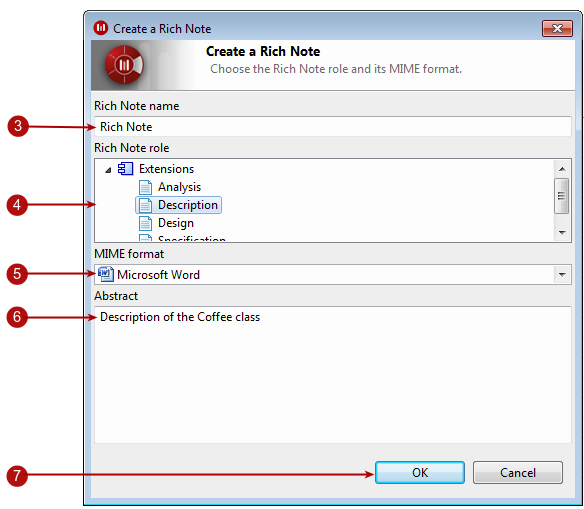

// Disable all captions for figures.
:!figure-caption:
// Path to the stylesheet files
:stylesdir: .

= Ajouter des notes riches aux éléments

Modelio vous permet de créer des notes riches. Ces notes riches peuvent être des documents MS Office ou bien des documents OpenDocuments (LibreOffice ou OpenOffice).

== Créer une note riche

.Le processus de création d'une note riche
image::images/Modeler-_modeler_building_models_add_richnotes_modifelements_009_1.png[1]

*Étapes :*

1.  Sélectionnez l'élément auquel vous souhaitez ajouter une note riche.
2.  Dans la vue "Notes et contraintes", cliquez sur l'icône "Ajouter une note riche". La fenêtre "Création d'une note riche" apparaît alors. 
3.  Dans cette fenêtre, ajoutez un nom à la note riche en cliquant dans le champ "Nom de la note riche" et en y saisissant le nom de la note.
4.  Dans le champ "Rôle de la note riche", choisissez un rôle dans la liste.
5.  Dans le champ "Format MIME", sélectionnez un format dans la liste.
6.  Enfin, ajoutez une brève description de votre note dans le champ "Abstract".
7.  Cliquez sur OK pour créer la note riche.

*Note :* Dans le cas où Modelio n'arrive pas à trouver automatiquement l'éditeur OpenDocuments (LibreOffice ou OpenOffice), vérifiez vos <<Modeler-_modeler_modelio_settings_preferences.adoc#,préférences pour les notes riches LibreOffice / OpenOffice>> définies au niveau des préférences Modelio.

== L'éditeur de notes riches

.L'éditeur de notes riches
image::images/Modeler-_modeler_building_models_add_richnotes_modifelements_010.png[2]

*Note :* Les notes riches MS Office sont sauvegardées en utilisant la deuxième icône image:images/Modeler-_modeler_building_models_add_richnotes_save_16.png[4] dans la barre d'outils Modelio.

== Créer un template pour la création de nouvelles notes riches

Vous pouvez créer un fichier par défaut pour chaque nom de rôle. Ces fichiers doivent être stockés dans le répertoire .projectdata/admin/documents.

Le fichier template peut être nommé :

* role-name.mime-type.dat like file
* role-name.dat like file.

All invalid characters in a file name in the document type and MIME type are replaced by '_' when the file is searched for. Les caractères invalides dans un nom de fichier au niveau du type du document et du type MIME sont remplacés par '_' lors de la recherche du fichier. Les caractères invalides sont les suivants : [ : \ / * ? | < > ].

Voici une liste de tous les types MIME disponibles dans Modelio :

[cols=",",options="header",]
|======================================================================================================================
|Format |Mime type
|HTML (LibreOffice) |text/html/ooo.html
|HTML (Word) |text/html.html
|Microsoft Excel 2000 |application/vnd.ms-excel.xls
|Microsoft Excel 2007 |application/vnd.openxmlformats-officedocument.spreadsheetml.sheet.xlsx
|Microsoft PowerPoint |application/vnd.ms-powerpoint.ppt
|Microsoft PowerPoint 2007 Presentation |application/vnd.openxmlformats-officedocument.presentationml.presentation.pptx
|Microsoft Word 2007 |application/vnd.openxmlformats-officedocument.wordprocessingml.document.docx
|Microsoft Word 6 |application/msword.doc
|OpenOffice Calc Spreadsheet |application/vnd.oasis.opendocument.spreadsheet.ods
|OpenOffice Draw Graphic |application/vnd.oasis.opendocument.graphics.odg
|OpenOffice Formula |application/vnd.oasis.opendocument.formula.odf
|OpenOffice Impress Presentation |application/vnd.oasis.opendocument.presentation.odp
|OpenOffice Web Text |application/vnd.oasis.opendocument.text-web.odh
|OpenOffice Writer Text Document |application/vnd.oasis.opendocument.text.odt
|RTF |text/rtf.rtf
|======================================================================================================================

