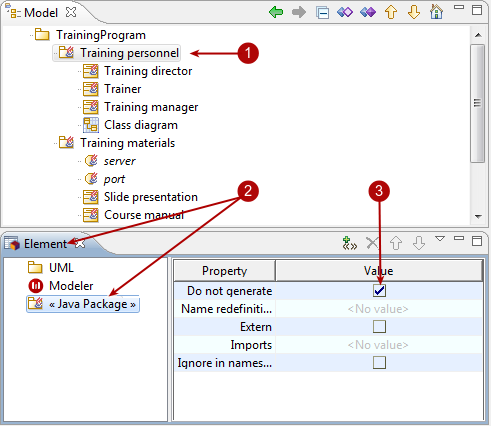

// Disable all captions for figures.
:!figure-caption:
// Path to the stylesheet files
:stylesdir: .

[[Ajouter-des-tagged-values-aux-éléments]]

[[ajouter-des-tagged-values-aux-éléments]]
= Ajouter des tagged values aux éléments

[[Introduction]]

[[introduction]]
===== Introduction

Les tagged values sont ajoutées dans les vues <<Modeler-_modeler_interface_properties_view.adoc#,Propriétés>> ou <<Modeler-_modeler_interface_uml_prop_view.adoc#,Elément>> aux éléments sélectionnés dans la vue "Modèle".

La vue "Elément" contient un tableau où les tagged values sont affichées. Ce tableau présente toutes les tagged values disponibles pour un élément sélectionné. Les tagged values disponibles sont présentées par module.

Il existe trois types de tagged values :

* Les tagged values qui ne prennent pas de paramètres,
* Les tagged values pouvant prendre un seul paramètre,
* Les tagged values pouvant prendre plusieurs paramètres.

[[Ajouter-une-tagged-value-qui-ne-prend-pas-de-paramètres]]

[[ajouter-une-tagged-value-qui-ne-prend-pas-de-paramètres]]
===== Ajouter une tagged value qui ne prend pas de paramètres

.Ajout d'une tagged value qui ne prend pas de paramètres à un package

*Étapes :*

1.  Sélectionnez l'élément auquel vous souhaitez ajouter une tagged value.
2.  Ouvrez la vue "Elément" et puis le groupe approprié.
3.  Les tagged values qui ne prennent pas de paramètres sont ajoutées ou enlevées simplement en cochant ou décochant leur case.

[[Ajouter-une-tagged-value-qui-prend-un-seul-paramètre]]

[[ajouter-une-tagged-value-qui-prend-un-seul-paramètre]]
===== Ajouter une tagged value qui prend un seul paramètre

.Ajout d'une tagged value qui prend un seul paramètre à une classe
image::images/Modeler-_modeler_building_models_add_tv_modifelements_005.png[3]

*Étapes :*

1.  Sélectionnez l'élément auquel vous souhaitez ajouter une tagged value.
2.  Ouvrez la vue "Elément" et puis le groupe approprié.
3.  Les tagged values pouvant prendre un seul paramètre sont ajoutés à l'élément sélectionné lorsque vous saisissez une valeur pour le paramètre. Cliquez sur le champ de la colonne "Valeur" pour la tagged value que vous souhaitez ajouter puis saisissez une valeur pour le paramètre. Validez en appuyant sur la touche Entrée.

[[Ajouter-une-tagged-value-qui-peut-prendre-plusieurs-paramètres]]

[[ajouter-une-tagged-value-qui-peut-prendre-plusieurs-paramètres]]
===== Ajouter une tagged value qui peut prendre plusieurs paramètres

.Ajout d'une tagged value qui peut prendre plusieurs paramètres à une classe
image::images/Modeler-_modeler_building_models_add_tv_modifelements_006.png[image]

*Étapes :*

1.  Sélectionnez l'élément auquel vous souhaitez ajouter une tagged value.
2.  Ouvrez la vue "Elément" et puis le groupe approprié.
3.  Les tagged values pouvant prendre plusieurs paramètres sont ajoutés à l'élément sélectionné lorsque vous saisissez des valeurs des différents paramètres. Pour ce faire, cliquez dans le champ de la colonne "Valeur" pour le paramètre que vous voulez ajouter. La fenêtre "Edition des paramètres d'une tagged value" apparaît alors.
4.  Saisissez les différentes valeurs des paramètres (avec leur namespace complet) et cliquez sur image:images/Modeler-_modeler_building_models_add_tv_add.png[5] pour valider chaque saisie. Pour finir, cliquez sur OK.

