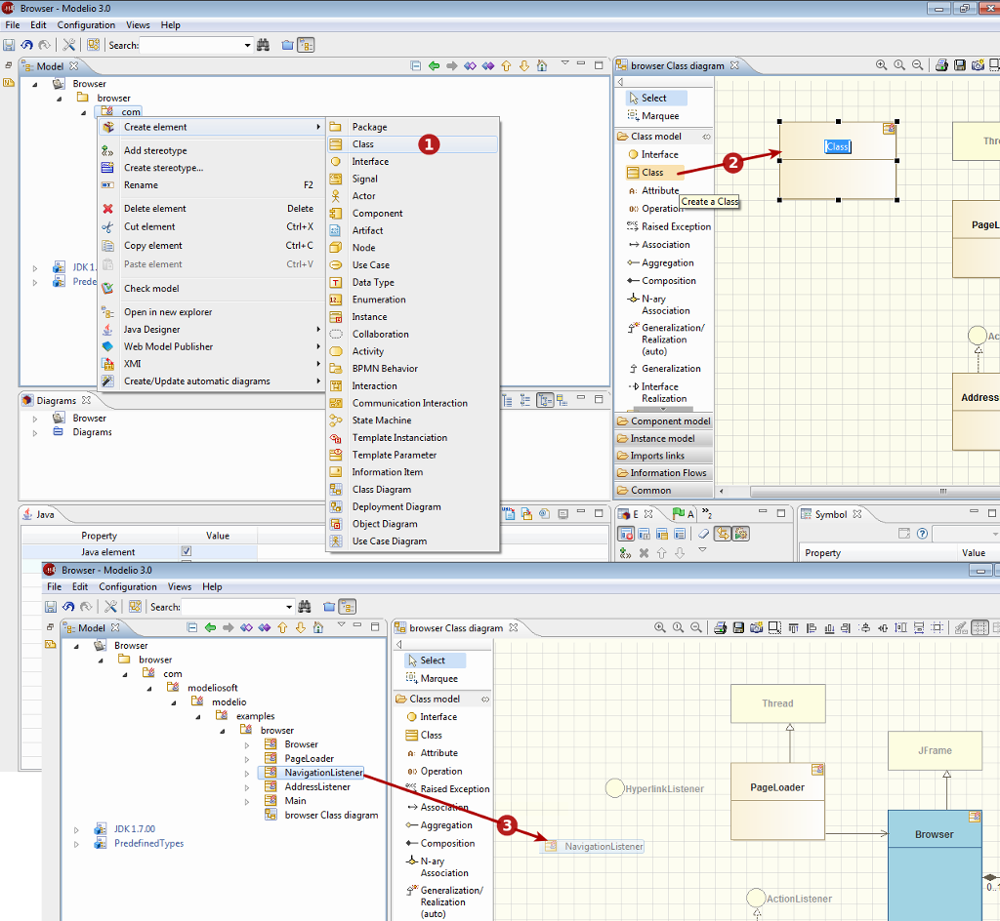

// Disable all captions for figures.
:!figure-caption:

[[Créer-des-éléments]]

[[créer-des-éléments]]
= Créer des éléments

[[Les-trois-façons-de-créer-des-éléments]]

[[les-trois-façons-de-créer-des-éléments]]
===== Les trois façons de créer des éléments

.Les trois façons de créer des éléments

*Légende :*

1. En utilisant la commande 'Créer un élément' du menu contextuel.
2. En utilisant les icônes de la palette des diagrammes.
3. En utilisant le glisser-déposer depuis l'explorateur vers les diagrammes.

