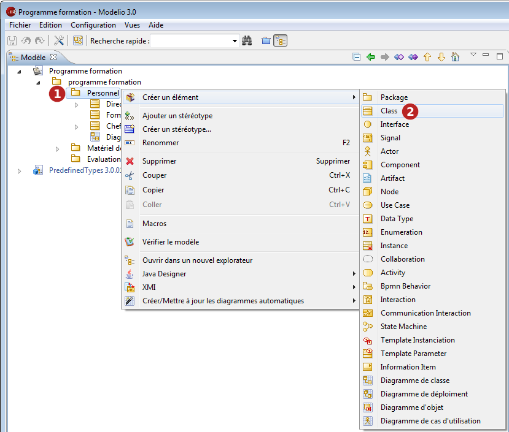

// Disable all captions for figures.
:!figure-caption:

[[Créer-des-éléments-dans-lexplorateur-de-modèle]]

[[créer-des-éléments-dans-lexplorateur-de-modèle]]
= Créer des éléments dans l'explorateur de modèle

Dans la vue "Modèle" et la vue d'édition des diagrammes, vous pouvez créer des éléments de modèle en utilisant la commande "Créer un élément".

1.  Cliquez-droit sur l'élément sous lequel vous voulez créer votre nouvel élément.
2.  Dans le menu contextuel "Créer un élément", sélectionnez le type d'élément que vous souhaitez créer.

.Création d'une classe sous une classe dans la vue "Modèle"

*Note :* Les éléments que vous pouvez créer varient selon le type de l'élément sélectionné. Les éléments disponibles sont organisés en groupes d'éléments similaires ou liés, afin de vous faciliter la recherche du type d'élément que vous voulez créer.

