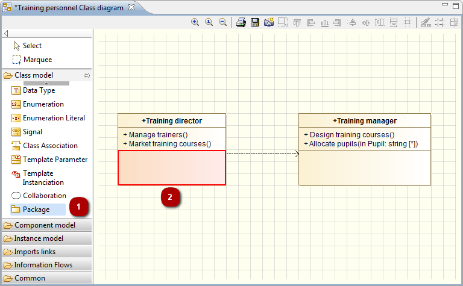
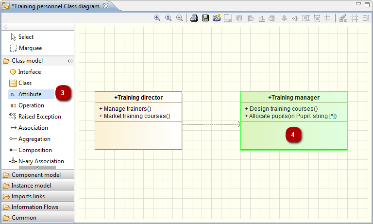

// Disable all captions for figures.
:!figure-caption:
// Path to the stylesheet files
:stylesdir: .

= Créer des éléments dans les diagrammes

Dans les diagrammes Modelio, vous pouvez créer des éléments en vous servant des icônes dans la palette à gauche du diagramme.

Tous les diagrammes Modelio bénéficient de la fonctionnalité "expert de modélisation", qui fournit une aide en temps réel lors de la création d'éléments dans les diagrammes.

Exemples :

.Création d'un package au sein d'une classe dans un diagramme de classes – opération interdite

Si vous essayez de créer un élément qui n'est pas autorisé (dans cet exemple, si vous essayez de créer un package *(1)* sous une classe), l'expert de modélisation Modelio affiche l'élément concerné en rouge *(2)*, indiquant ainsi que l'opération de création n'est pas autorisée.

.Création d'un attribut au sein d'une classe dans un diagramme de classes – opération autorisée

Si vous essayez de créer un élément qui est autorisé (dans cet exemple, si vous essayez de créer un attribut *(3)* sous une classe), l'expert de modélisation Modelio affiche l'élément concerné en vert *(4)*, indiquant ainsi que l'opération de création est autorisée.

