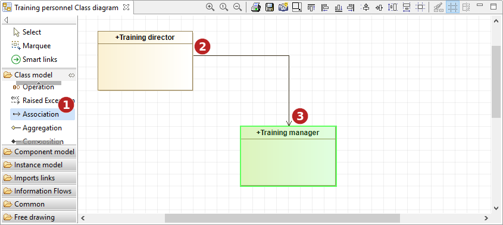
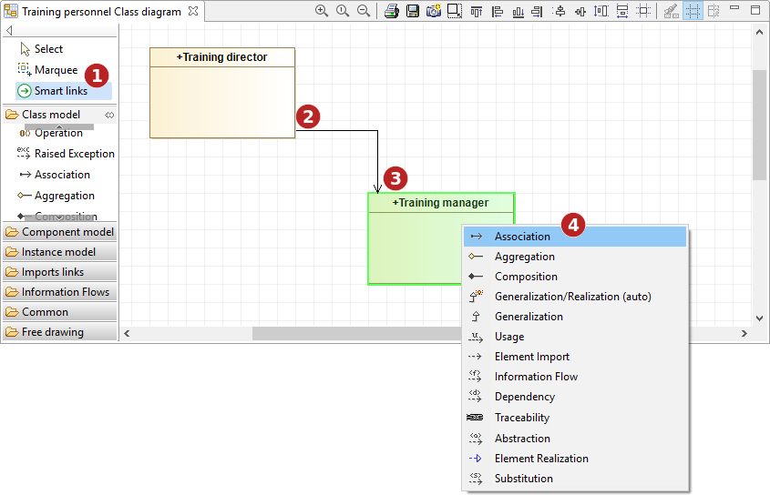

// Disable all captions for figures.
:!figure-caption:
// Path to the stylesheet files
:stylesdir: .

= Créer des liens dans un diagramme

Il existe plusieurs moyens de créer des liens dans les diagrammes de Modelio.

[[La-palette-des-diagrammes]]

[[la-palette-des-diagrammes]]
===== La palette des diagrammes

Tous les diagrammes Modelio bénéficient de la fonctionnalité "expert de modélisation", qui fournit une aide à la création de liens en temps réel. Si vous essayez de créer un lien autorisé (par exemple, une association entre deux classes), l'expert de modélisation affiche l'élément concerné en vert, indiquant ainsi que l'opération de création est autorisée. En revanche, si vous essayez de créer un lien non-autorisé (par exemple, une association entre un package et une classe), l'expert de modélisation affiche l'élément concerné en rouge, indiquant ainsi que l'opération de création n'est pas autorisée.

.Création d'une association entre deux classes en mode orthogonal

*Étapes :*

1. Cliquez sur l'icône "Créer une association" dans la palette du diagramme.
2. Cliquez sur la classe d'origine.
3. Tracez votre lien, avec des points intermédiaires, si vous le désirez, puis cliquez sur la classe de destination.

Dans les diagrammes Modelio, il existe quatre façons de tracer un lien :

* Le mode orthogonal, qui permet de tracer des liens avec un ou plusieurs angles droits,
* Le mode direct, où un lien est présenté sous forme de ligne droite,
* Le mode libre, qui permet de tracer les liens de la manière de votre choix,
* Le mode cible partagée, qui permet de créer des liens sous forme de râteau.

*Note :* Si vous souhaitez tracer un lien en mode libre, il suffit de maintenir enfoncée la touche "SHIFT" de votre clavier lors du traçage du lien.

[[Loutil-Smart-links]]

[[loutil-smart-links]]
=== L'outil Smart links

Smart links est un nouvel outil pour créer rapidement et facilement des liens dans les diagrammes. Il peut être utilisé de deux manières différentes.

*Depuis la palette du diagramme*

.Création d'une association entre deux classes à l'aide de la commande Smart links de la palette du diagramme

*Étapes :*

1. Cliquer sur l'icône "Smart links" dans la palette du diagramme +
2. Cliquer sur la classe d'origine +
3. Cliquer sur la classe de destination +
4. Choisir un type de lien dans la liste

*Avec la souris*

.Création d'une association entre deux classes à l'aide de l'outil Smart links
image::images/Modeler-_modeler_building_models_creating_links_diagrams_creating_link-type_elements_in_diagrams_3.png[4]

*Étapes :*

1. Placer le curseur de la souris sur la classe d'origine et attendre une seconde +
2. Lorsque les ancres image:images/Modeler-_modeler_diagrams_drawing_links_SmartLinks_handle.png[8] apparaissent, cliquer sur l'une d'elle et maintenir enfoncé le bouton de la souris +
3. Déplacer le curseur vers la classe de destination comme pour glisser-déposer le lien dessus +
4. Relâcher le bouton lorsque le curseur est sur la classe de destination, puis choisir un type de lien dans la liste

*Note :* Si vous ne voulez pas voir apparaître les ancres lors du survol des éléments, vous pouvez les désactiver dans la vue *Symbole* du diagramme : 
image::images/Modeler-_modeler_diagrams_drawing_links_creating_link-type_elements_in_diagrams_4_FR.png[7]

