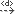
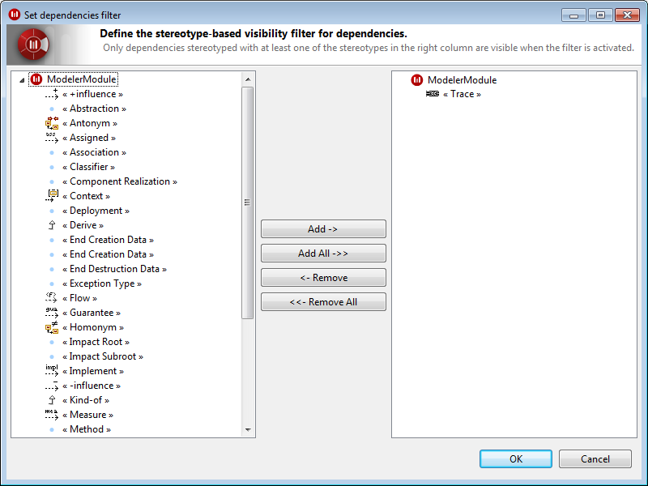

// Disable all captions for figures.
:!figure-caption:

= Créer des liens dans l'éditeur de liens

L'éditeur de liens facilite grandement la création de nouveaux liens dans votre modèle.

Lorsque l'éditeur de liens est en mode "édition" (c'est à dire, lorsque votre sélection est fixée par l'activation de la petite punaise [image:images/Modeler-_modeler_building_models_creating_links_linkeditor_EditionMode.png[1]]), vous pouvez sélectionner n'importe quel élément dans une autre vue (par exemple, e.g. la vue <<Modeler-_modeler_interface_uml_view.adoc#,"Modèle">>) puis le glisser-déposer dans l'éditeur de liens, afin de créer un nouveau lien entre l'élément en question et l'élément représenté par le nœud central. Vous pouvez même glisser-déposer plusieurs éléments en même temps, pourvu qu'il s'agisse de plusieurs instances de la même méta-classe. Par exemple, vous pouvez glisser-déposer plusieurs classes ou plusieurs packages en même temps, mais pas une classe et un package en même temps.

L'orientation des liens que vous créez (soit depuis le nœud central vers l'élément glissé-déposé, soit depuis l'élément glissé-déposé vers le noeud central) est déterminée par l'endroit où vous glissez-déposez l'élément dans l'éditeur de liens, par rapport au noeud central.

L'éditeur de liens essaie de déterminer le type du lien à créer selon les types de liens visibles au moment de la création et selon la méta-classe de l'élément glissé-déposé, et celle du nœud central. S'il y a plusieurs types possibles, une fenêtre s'ouvrira, vous demandant de choisir le type exact à utiliser lors de la création du nouveau lien.

=== Exemple

Imaginons que vous veuillez rajouter plusieurs liens de traçabilité entre les exigences formulées par votre client et vos classes d'implémentation.

Tout d'abord, il peut vous être utile d'activer la <<Modeler-_modeler_interface_perspectives.adoc#Trace-Perspective.html#,perspective de traçabilité>>. Cette perspective organise les vues de manière à faciliter la création de liens de traçabilité : en effet, l'éditeur de liens s'affiche au centre, avec un explorateur de modèle de chaque côté.

Ensuite, vous allez configurer l'éditeur de liens en effectuant les deux opérations suivantes :

1.  Configurez l'éditeur de liens pour que seuls les liens de dépendance soient visibles [])et activez le filtrage des dépendances ([image:images/Modeler-_modeler_building_models_creating_links_linkeditor_Filter.png[6]] activé).
2.  Configurez le filtre des dépendances pour qu'il ne montre que les dépendances stéréotypées «trace» (pour ce faire, cliquez sur le bouton "Définir le filtrage des dépendances" [image:images/Modeler-_modeler_building_models_creating_links_linkeditor_EditFilter.png[7]] et faites que la colonne de droite ne contienne que le stéréotype «trace»).

.Fenêtre de définition de filtre sur les dépendances

A partir de ce point, la création du lien proprement dite est rapide et facile. Désactivez la punaise de l'éditeur des liens ([image:images/Modeler-_modeler_building_models_creating_links_linkeditor_EditionMode.png[1]]) si celle-ci a été activée, puis sélectionnez une exigence dans n'importe quelle vue (la vue "Analyst", un diagramme, ...). L'exigence sélectionnée devient alors le nœud central. Continuez en activant la punaise dans l'éditeur de liens ([image:images/Modeler-_modeler_building_models_creating_links_linkeditor_EditionMode.png[1]]) afin de fixer votre choix, puis glissez-déposez une ou plusieurs classes (depuis la vue "Modèle" par exemple) dans l'éditeur de liens.

image::images/Modeler-_modeler_building_models_creating_links_linkeditor_LinkEditorDragDrop.png[9]

*Étapes :*

1. Cliquez sur l'élément dans la vue "Modèle".
2. Glissez-déposez l'élément dans l'éditeur de liens et relâchez le bouton de la souris.

