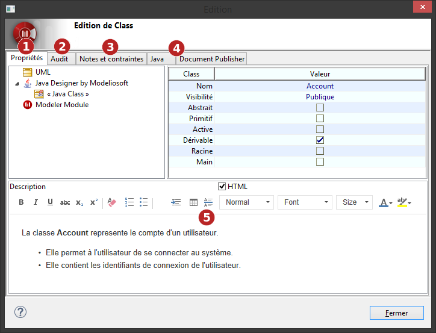
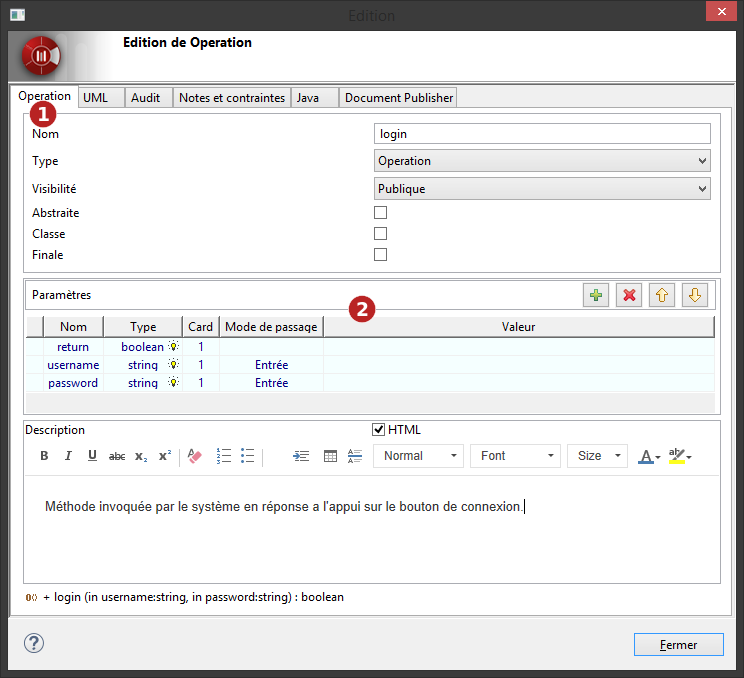
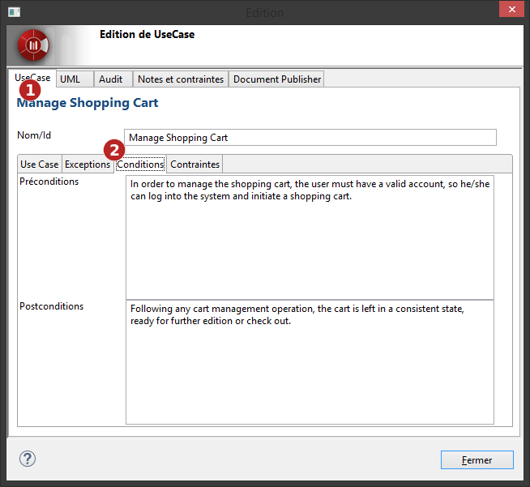

// Disable all captions for figures.
:!figure-caption:

[[Editer-des-éléments-via-les-boites-dédition]]

[[editer-des-éléments-via-les-boites-dédition]]
= Editer des éléments via les boites d'édition

Les éléments peuvent être édités via une boite d'édition en utilisant le double-clic ou la commande contextuelle ' Editer l'élément...'.

.Boite d'édition générique

*Légende :*

1.  Onglet Propriétés, similaire à la vue <<Modeler-_modeler_building_models_modifying_element_props.adoc#,Element>>.
2.  Onglet Audit, similaire à la fenêtre <<Modeler-_modeler_handy_tools_model_audit.adoc#,Audit de modèle>>.
3.  Onglet Notes et contraintes, similaire à la vue <<Modeler-_modeler_building_models_add_notes.adoc#,Notes et contraintes>>.
4.  Onglets Modules, apparaissant lorsqu'ils sont pertinents.
5.  Zone d'édition rapide pour la note "Description".

[[Boites-dédition-spécifiques]]

[[boites-dédition-spécifiques]]
== Boites d'édition spécifiques

Certains éléments disposent de boites d'édition spécifiques :

[[Opérations]]

[[opérations]]
===== Opérations

.Boite d'édition d'une opération

*Légende :*

1.  Onglet dédié pour l'opération.
2.  Zone de gestion des paramètres de l'opération.

[[Use-Case]]

[[use-case]]
===== Use Case

.Boite d'édition d'un use Case

*Légende :*

1.  Onglet dédié pour le Use Case.
2.  Onglets pour les notes spécifiques aux Use Cases.

