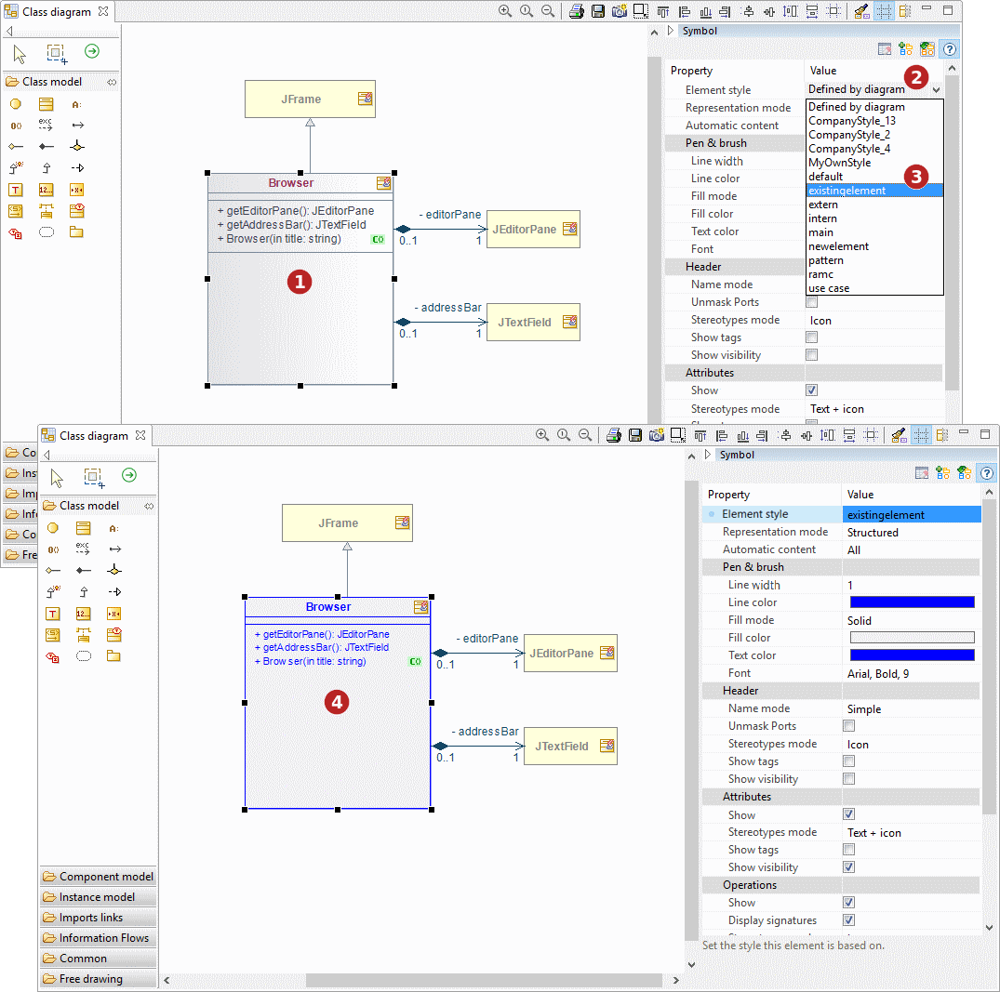

// Disable all captions for figures.
:!figure-caption:
// Path to the stylesheet files
:stylesdir: .

[[Définir-les-options-graphiques-dans-les-diagrammes]]

[[définir-les-options-graphiques-dans-les-diagrammes]]
= Définir les options graphiques dans les diagrammes

[[Présentation-générale]]

[[présentation-générale]]
===== Présentation générale

Les options graphiques d'un diagramme sont listées dans la vue Symbol qui peut être affichée directement dans l'éditeur de diagramme :

.Affichage de la vue Symbole
image::images/Modeler-_modeler_diagrams_graphic_options_Diag_GraphProp_001.gif[image]

*Étapes :*

1. Dépliez la vue Symbole 
2. La vue Symbole apparaît dans l'éditeur de diagramme.
 

[[Présentation-détaillée]]

[[présentation-détaillée]]
===== Présentation détaillée

.Une vue rapprochée de la vue Symbole
image::images/Modeler-_modeler_diagrams_graphic_options_Diag_GraphProp_003.png[image]

*Légende :*

1. Propriétés graphiques
2. Propriété graphique modifiée (apparaît en gras) 
3. Aire de description de la propriété graphique sélectionnée 
4. Bouton d'annulation des modifications locales 
5. Bouton de création de nouveau style à partir de modifications locales 
6. Bouton de mise à jour d'un thème de diagramme existant
7. Bouton d'affichage / masquage de l'aire de description des propriétés graphiques 

 

[[Modification-des-propriétés-graphiques-dun-élément-de-diagramme]]

[[modification-des-propriétés-graphiques-dun-élément-de-diagramme]]
===== Modification des propriétés graphiques d'un élément de diagramme

Pour modifier les propriétés graphiques d'un élément de diagramme, vous pouvez lui appliquer un nouveau style, ou changer ses propriétés une à une manuellement.

*Application d'un nouveau style* 

[[Application-dun-style-existant-à-lélément-sélectionné]]

[[application-dun-style-existant-à-lélément-sélectionné]]
Application d'un style existant à l'élément sélectionné

*Étapes :*

1. Sélectionner un élément +
2. Dans la vue Symbole, déplier la liste des styles d'élément +
3. Choisir un style +
4. Le nouveau style est appliqué à l'élément sélectionné +
 
 

*Modification d'une propriété graphique* 

[[Modification-de-la-couleur-de-lélément-sélectionné]]

[[modification-de-la-couleur-de-lélément-sélectionné]]
Modification de la couleur de l'élément sélectionné

*Étapes :* 

1. Sélectionner un élément +
2. Dans la vue Symbole, cliquer sur la propriété de couleur de remplissage +
3. Choisir une couleur +
4. La couleur de remplissage est appliquée à l'élément sélectionné +

*Note :* Les modifications peuvent être annulées en cliquant sur le bouton "Annuler les modifications locales" image:images/Modeler-_modeler_diagrams_graphic_options_Diag_GraphProp_006.png[image]

[[Créer-ses-propres-styles-déléments-de-diagramme]]

[[créer-ses-propres-styles-déléments-de-diagramme]]
===== Créer ses propres styles d'éléments de diagramme

Pour créer vos propres styles d'éléments de diagramme, appliquez la procédure expliquée à la page <<Modeler-_modeler_modelio_settings_diagram_styles.adoc#,Styles & thèmes de diagrammes>>.   +
 

