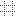

// Disable all captions for figures.
:!figure-caption:
// Path to the stylesheet files
:stylesdir: .

= Activer la grille

La grille vous facilite l'alignement précis des éléments présents dans les diagrammes Modelio.

Pour activer la grille dans un diagramme, utilisez les cases à cocher "Grille – Afficher" et "Griller – Activer" dans l'onglet "Symbole" du diagramme, ou bien cliquer sur l'icône  dans la barre d'outils du diagramme.

