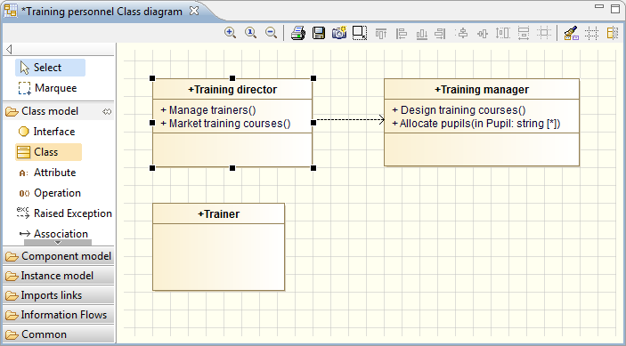

// Disable all captions for figures.
:!figure-caption:

[[Gérer-les-éléments-dans-un-diagramme]]

[[gérer-les-éléments-dans-un-diagramme]]
= Gérer les éléments dans un diagramme

[[Sélectionner-un-élément-dans-un-diagramme]]

[[sélectionner-un-élément-dans-un-diagramme]]
===== Sélectionner un élément dans un diagramme

Pour sélectionner un élément dans un diagramme, il suffit de cliquer dessus avec le bouton gauche de la souris.

Lorsqu'un élément a été sélectionné, il apparaît entouré de points de contrôle.

.Une classe sélectionnée dans un diagramme de classes

[[Sélectionner-plusieurs-éléments-dans-un-diagramme]]

[[sélectionner-plusieurs-éléments-dans-un-diagramme]]
===== Sélectionner plusieurs éléments dans un diagramme

Pour sélectionner plusieurs éléments à la fois dans un diagramme, deux possibilités s'offrent à vous :

* Soit vous maintenez la touche "*Maj*" ou la touche "*Ctrl*" enfoncée en sélectionnant les différents éléments,

* Soit vous cliquez dans le diagramme puis vous déplacez la souris, tout en maintenant enfoncé le bouton gauche, de façon à dessiner un rectangle autour des éléments que vous voulez sélectionner. La sélection est validée lorsque le bouton gauche de la souris est relâché. Chaque élément sélectionné apparaît alors entouré de points de contrôle.

[[Sélectionner-un-élément-de-diagramme-dans-la-vue-ldquoModèlerdquo]]

[[sélectionner-un-élément-de-diagramme-dans-la-vue-modèle]]
===== Sélectionner un élément de diagramme dans la vue "Modèle"

Il peut être très utile de pouvoir sélectionner un élément donné dans un diagramme, puis de le sélectionner automatiquement dans la vue "Modèle", sans avoir à faire la sélection manuellement.

Pour ce faire, il suffit de cliquer droit sur l'élément dans le diagramme pour ouvrir le menu contextuel, puis de lancer la commande "Sélectionner dans l'explorateur". Vous pouvez aussi utiliser le raccourci "*Crtl+Entrée*". Ceci active la vue "Modèle", l'affiche au premier plan et sélectionne automatiquement dans celle-ci l'élément déjà sélectionné dans le diagramme.

*Note :* Cette fonctionnalité n'est disponible que pour les éléments de type boîte.

[[Déplacer-un-élément-vers-une-autre-position-dans-un-diagramme]]

[[déplacer-un-élément-vers-une-autre-position-dans-un-diagramme]]
===== Déplacer un élément vers une autre position dans un diagramme

Si vous souhaitez déplacer un élément vers une autre position, il suffit de le sélectionner en maintenant enfoncé le bouton gauche de la souris, puis de le déplacer à la position de votre choix. Vous pouvez visualiser la position de l'objet lors de son déplacement.

Si l'élément a des liens (des associations, des generalisations, ...), ceux-ci le "suivent" graphiquement lors de son déplacement.

[[Déplacer-un-élément-vers-un-autre-élément-parent-dans-un-diagramme]]

[[déplacer-un-élément-vers-un-autre-élément-parent-dans-un-diagramme]]
===== Déplacer un élément vers un autre élément parent dans un diagramme

A l'aide de la fonctionnalité glisser-déposer, il est possible de déplacer un élément d'un élément parent vers un autre. Par exemple, vous pouvez déplacer une classe depuis un package vers un autre.

Pour cela, il suffit de sélectionner l'élément à déplacer et puis de le faire glisser vers son nouvel élément parent. La mise à jour dans la vue "Modèle" se fait automatiquement, et la cohérence du modèle est maintenue à tout moment. Si le nouveau parent est un élément non-autorisé, il sera affiché en rouge, tandis que les éléments autorisés sont affichés en vert.

[[Modifier-le-nom-dun-élément-dans-un-diagramme]]

[[modifier-le-nom-dun-élément-dans-un-diagramme]]
===== Modifier le nom d'un élément dans un diagramme

Pour changer le nom d'un élément dans un diagramme, il suffit de sélectionner l'élément puis d'appuyer sur F2. Le nom de l'élément est alors surligné et vous pouvez saisir un nouveau nom directement.

[[Supprimer-un-élément-dun-diagramme]]

[[supprimer-un-élément-dun-diagramme]]
===== Supprimer un élément d'un diagramme

Pour supprimer un élément d'un diagramme, deux possibilités s'offrent à vous :

* Soit vous sélectionnez l'élément dans le diagramme et puis vous appuyez sur la touche "Suppr" de votre clavier.
* Soit vous cliquez-droit sur l'élément dans le diagramme pour ouvrir son menu contextuel puis vous lancez la commande "Supprimer la sélection".

Dans les deux cas, la vue "Modèle" est automatiquement mise à jour et la cohérence du modèle maintenue.

