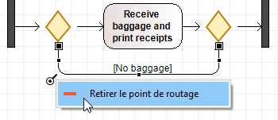
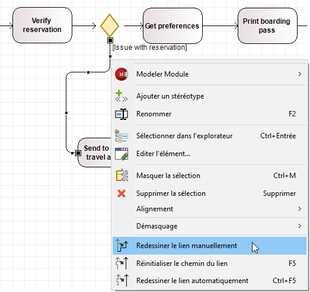

// Disable all captions for figures.
:!figure-caption:
// Path to the stylesheet files
:stylesdir: .

= Gérer les liens dans un diagramme

===== Déplacer un lien

Des liens simples sans angles peuvent être déplacés en cliquant sur le lien, en maintenant le bouton gauche de la souris enfoncé, en déplaçant le lien vers la nouvelle position souhaitée et en relâchant le bouton de la souris.

Pour les liens avec un ou plusieurs angles, vous pouvez déplacer chaque partie individuelle du lien.

===== Déplacer une extrémité de lien

Pour déplacer une extrémité de lien, il suffit de faire un clic gauche sur le point correspondant que vous souhaitez déplacer et de le faire glisser vers la nouvelle position. Lorsque vous relâchez le bouton gauche de la souris, l'extrémité du lien est repositionnée.

*Note 1 :* Si vous essayez de déplacer une extrémité de lien vers une position non autorisée, l'élément concerné sera mis en surbrillance rouge.

*Note 2 :* Certains éléments (comme les éléments BPMN, State ou ArchiMate) disposent de points d'ancrage fixes, qui permettent d'y accrocher les liens de sorte à ce que leur points d'origines/destinations ne changent pas par la suite, lors des déplacements ou du retaillage de ces éléments. Le nombre d’ancres fixes dépend de la taille de l’élément.

===== Retirer un point de routage

Pour retirer un point de routage, il suffit de faire un clic droit sur le point que vous souhaitez retirer et cliquer sur "Retirer un point de routage". Le lien sera automatiquement redessiné au plus court entre les points de routages amont et aval.

.Retirer un point de routage

===== Redessiner un lien

.Commandes "Redessiner un lien"

====== Redessiner un lien manuellement

Si vous souhaitez redessiner un lien, faites un clic droit sur le lien pour ouvrir le menu contextuel et exécuter la commande "Redessiner le lien manuellement"

La représentation graphique du lien disparaît alors, vous laissant libre de redessiner le tracé du lien comme vous le souhaitez.
Maintenir la touche SHIFT enfoncée change le style de trace du lien (Direct ou Orthogonal).
 

====== Redessiner un lien automatiquement

Si vous souhaitez redessiner un lien automatiquement, vous avez deux façons d'activer la commande "Redessiner le lien automatiquement":

* soit en sélectionnant le lien et en appuyant sur "CTRL-F5"
* soit en faisant un clic droit sur le lien pour ouvrir le menu contextuel et exécuter la commande "Redessiner le lien automatiquement"

Le lien sera complétement redessiné au plus court et ses points de routage retirés.  

*Note :* Cette commande n'est disponible que pour les liens orthogonaux.

====== Réinitialiser le chemin du lien

Si vous souhaitez réinitialiser le chemin d'un lien automatiquement, vous avez deux façons d'activer la commande "Réinitialiser le chemin du lien":

* soit en sélectionnant le lien et en appuyant sur "F5"
* soit en faisant un clic droit sur le lien pour ouvrir le menu contextuel et exécuter la commande "Réinitialiser le chemin du lien"

Le lien sera redessiné au plus court mais ses ancres et points de routage seront conservés.  

*Note :* Cette commande n'est disponible que pour les liens orthogonaux.

===== Modifier les valeurs d'un lien

Si vous souhaitez saisir ou modifier les valeurs d'un lien, vous pouvez le faire directement dans le diagramme en appuyant sur *F2* ou en double-cliquant sur son label.

.Saisie directe d'une valeur pour une association
image::images/Modeler-_modeler_diagrams_handling_links_EditRole.png[2]

Les valeurs de lien peuvent également être saisies ou modifiées dans la vue "Propriétés" du lien.

