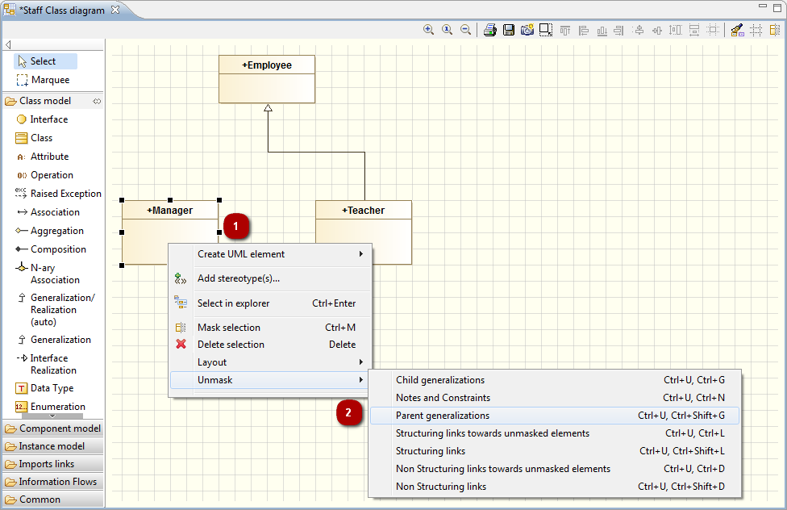
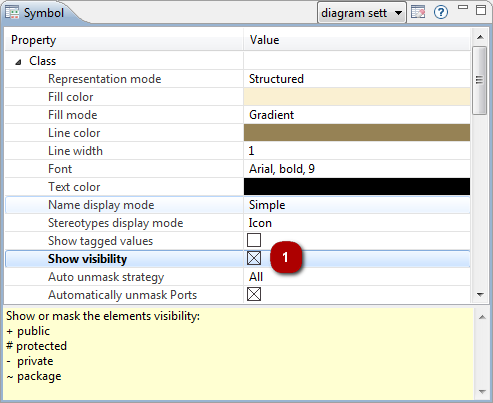

// Disable all captions for figures.
:!figure-caption:

[[Afficher-et-masquer-des-éléments-dans-un-diagramme]]

[[afficher-et-masquer-des-éléments-dans-un-diagramme]]
= Afficher et masquer des éléments dans un diagramme

[[Introduction]]

[[introduction]]
===== Introduction

Les diagrammes peuvent rapidement devenir désordonnés et par conséquent difficiles à gérer si leur contenu et les liens associés sont rendus visibles. C'est pour cette raison que Modelio vous permet de décider d'afficher ou de masquer les différents éléments de vos diagrammes, ainsi que les éléments qu'ils référencent.

Pour afficher des éléments, trois possibilités s'offrent à vous :

* Le service "glisser-déposer" d'un élément de la vue "Modèle" vers un diagramme,
* La commande "Démasquer" dans les menus contextuels,
* La définition d'une politique automatique de démasquage dans la vue *"Symbole"*.

Pour masquer des éléments, vous avez également le choix entre trois possibilités :

* Le raccourci *"Ctrl+M"* dans la vue d'édition des diagrammes,
* La commande *"Masquer"* dans les menus contextuels,
* La définition d'une politique automatique de masquage dans la vue *"Symbole"*.

[[Afficher-un-élément-en-utilisant-le-glisser-déposer-depuis-la-vue-ldquoModèlerdquo]]

[[afficher-un-élément-en-utilisant-le-glisser-déposer-depuis-la-vue-modèle]]
===== Afficher un élément en utilisant le glisser-déposer depuis la vue "Modèle"

.Afficher une classe en utilisant le glisser-déposer
image::images/Modeler-_modeler_diagrams_showing_masking_elements_DiagDragDrop.png[2]

*Étapes :*

1. Cliquez-gauche sur l'élément dans la vue "Modèle".
2. En maintenant enfoncé le bouton gauche de la souris, glissez-déposez l'élément dans le diagramme, puis relâchez le bouton de la souris.

[[Afficher-un-élément-en-utilisant-la-commande-ldquoDémasquerrdquo]]

[[afficher-un-élément-en-utilisant-la-commande-démasquer]]
===== Afficher un élément en utilisant la commande "Démasquer"

.Afficher une généralisation entre deux classes

*Étapes :*

1. Cliquez-droit sur l'élément dans la vue d'édition des diagrammes.
2. Dans le menu *"Démasquer"* menu, cliquez sur la commande de démasquage de votre choix.

[[Afficher-des-éléments-en-utilisant-une-politique-automatique-de-démasquage-définie-dans-la-vue-ldquoSymbolerdquo]]

[[afficher-des-éléments-en-utilisant-une-politique-automatique-de-démasquage-définie-dans-la-vue-symbole]]
===== Afficher des éléments en utilisant une politique automatique de démasquage définie dans la vue "Symbole"

.Afficher les éléments en utilisant l'onglet 'symbole'
image::images/Modeler-_modeler_diagrams_showing_masking_elements_AutoUnmask.png[6]

*Étapes :*

1. Cliquez-droit sur l'élément dans la vue d'édition des diagrammes.
2. Dans la vue "Symbole", éditez le champ de votre choix pour l'élément concerné.

[[Afficher-tous-le-contenu-dune-classe]]

[[afficher-tous-le-contenu-dune-classe]]
===== Afficher tous le contenu d'une classe

Pour un élément sélectionné, le champ "Filtrer par visibilité" de la vue "Symbole" permet la définition d'une politique automatique de démasquage de son contenu, selon sa visibilité :

* Tous : Afficher tout les éléments internes
* Publics : N'afficher que les éléments publics
* Non-privés : Masquer les éléments privés
* Manuel : Afficher ou masquer les éléments individuellement

[[Les-options-de-représentation]]

[[les-options-de-représentation]]
===== Les options de représentation

Vous pouvez définir des options de représentation pour chaque élément dans un diagramme Modelio dans la vue *"Symbole"*.

.Affichage de la visibilité d'une classe

*Étapes :*

1. Dans la vue "Symbole", éditez le champ de votre choix pour l'élément concerné.

[[Masquer-un-élément]]

[[masquer-un-élément]]
===== Masquer un élément

image::images/Modeler-_modeler_diagrams_showing_masking_elements_MaskClass.png[5]

*Étapes :*

1. Cliquez sur un élément dans la vue d'édition des diagrammes.
2. Cliquez sur l'icône *"Masquer la sélection"* dans la barre d'outils de la vue d'édition des diagrammes.

