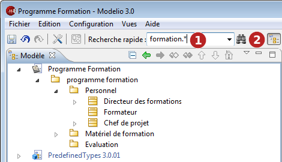
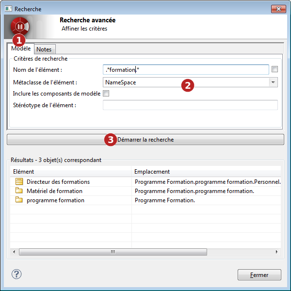
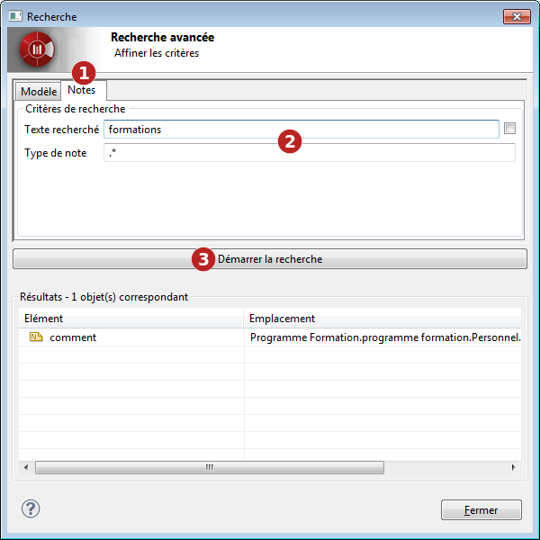

// Disable all captions for figures.
:!figure-caption:
// Path to the stylesheet files
:stylesdir: .

= Les outils de recherche de Modelio

Modelio propose deux outils de recherche : la recherche rapide et la recherche avancée.

==== Outil de recherche rapide

L'outil de recherche rapide Modelio permet de retrouver facilement des éléments dans un modèle, simplement à partir de leur nom.
Il ne considère que les éléments les plus pertinents du modèle :

* NameSpace pour UML (packages, classes, types de données...)
* Concept pour ArchiMate (tous les éléments de type "noeud")
* AnalytItem pour Analyste (conteneurs et éléments)
* BpmnProcess et BpmnFlowNode pour BPMN (tâches, évènements...)

Pour ce type d'éléments, la recherche rapide est basée sur les critères suivants :

* Éléments dont le nom correspond exactement à ce qui est saisi dans le champ de recherche.
* Les éléments dont le nom correspond à une expression régulière (par exemple, "Formation.*" localisera tous les éléments commençant par "Formation").

La *recherche rapide*, s'exécute simplement en entrant ce que vous voulez rechercher dans le champ de recherche et
*en appuyant sur entrée*.

S'il n'y a qu'un seul élément correspondant, il est automatiquement sélectionné dans le navigateur et
 aucune boîte de dialogue supplémentaire n'apparaît. S'il y a zéro ou plusieurs éléments correspondants, ils sont affichés
 dans une boîte de dialogue où vous pouvez affiner davantage vos critères de recherche.

La *recherche rapide* contient également un historique des dernières recherches afin qu'elles puissent être facilement rejouées à tout moment.

===== Lancer une recherche rapide

*Étapes :*

1. Entrez le modèle de nom d'élément que vous souhaitez rechercher et appuyez sur <enter>.
2. Cliquez sur la flèche à droite du champ de recherche rapide pour faire apparaître une liste des recherches
 vous avez précédemment effectué. Vous pouvez parcourir cette liste à l'aide des touches haut/bas de votre
  clavier ou à l'aide de votre souris. Pour sélectionner un élément à rechercher dans cette liste,
  cliquez simplement dessus pour le faire apparaître dans le champ puis terminez par <enter>.

==== Outil de recherche avancée
L'outil de recherche avancée ouvre une boîte de dialogue de configuration appelée *boîte de dialogue de recherche avancée* dans laquelle vous pouvez affiner les critères utilisés pour
la recherche.

Selon la configuration de votre projet, la *boîte de dialogue de recherche avancée* peut également comporter des onglets supplémentaires spécialisés pour certains types de recherche.

Par exemple, l'onglet "Note" permet de rechercher du texte dans le contenu de la note tandis que l'onglet "Analyste" est
spécialisé dans la recherche d'exigences dans le modèle d'analyste à partir de leurs propriétés.

===== Lancer une recherche avancée dans le modèle

*Étapes :*

. Facultatif : pré-saisissez une expression régulière pour la recherche.
. Cliquez sur le bouton de l'outil de recherche avancée image:images/Modeler-_modeler_handy_tools_advanced_search_AdvancedSearchIcon.png[3] pour ouvrir la boîte de dialogue de recherche avancée.

La *boîte de dialogue de recherche avancée* apparaît :

*Étapes :*

. Dans la boîte de dialogue "Rechercher", cliquez sur l'onglet "Modèle".
. Complétez les champs nécessaires, comme suit :
* Dans le champ *Modèle de nom d'élément*, entrez le nom ou l'expression que vous souhaitez rechercher. La case à cocher à droite de ce champ permet de préciser si vous souhaitez ou non que votre recherche soit sensible à la casse. Par défaut, la recherche n'est pas sensible à la casse.
Le champ est pré-rempli avec la valeur saisie dans le texte de recherche rapide.
* Dans le champ *Filtre de métaclasse*, sélectionnez la métaclasse du type d'élément que vous souhaitez rechercher. Cliquer dans le champ fait apparaître un sélecteur de métaclasse. Vous pouvez choisir plusieurs métaclasses pour une recherche plus puissante.
* Cochez ou décochez la case *Inclure les composants du modèle*, selon votre préférence.
* Dans le champ *Filtre de stéréotype*, entrez le nom du stéréotype que vous souhaitez utiliser comme filtre. Seuls les éléments stéréotypés par le stéréotype saisi apparaîtront alors dans les résultats de la recherche. Gardez vide pour ignorer les stéréotypes.
. Cliquez sur le bouton *Exécuter la recherche* pour lancer la recherche.
. Le tableau inférieur de la *boîte de dialogue de recherche avancée* répertorie les résultats de la recherche.

===== Lancer une recherche avancée dans les notes

*Étapes :*

. Dans la fenêtre "Recherche", cliquez sur l'onglet "Note".
. Cliquez sur le bouton de l'outil de recherche avancée image:images/Modeler-_modeler_handy_tools_advanced_search_AdvancedSearchIcon.png[3] pour ouvrir la boîte de dialogue de recherche avancée.

La *boîte de dialogue de recherche avancée* apparaît :

*Étapes :*

. Dans la boîte de dialogue "Rechercher", cliquez sur l'onglet "Notes".
. Entrez le texte que vous souhaitez rechercher et le type de note dans lequel vous souhaitez effectuer la recherche.
. Lancez la recherche.
. Le tableau inférieur de la *boîte de dialogue de recherche avancée* répertorie les résultats de la recherche.

===== Utilisation du tableau des résultats de la recherche dans la boîte de dialogue de recherche

Les éléments trouvés sont répertoriés dans le tableau des résultats au bas de la *boîte de dialogue de recherche avancée*.
Pour chaque élément trouvé, le tableau affiche son icône de type, son nom et son emplacement dans le modèle

* Cliquez dans les en-têtes de colonnes du tableau pour trier les résultats sur les valeurs des colonnes
* Un double-clic sur un élément de résultat de recherche dans le tableau des résultats le sélectionne et l'affiche dans le navigateur de modèles.

