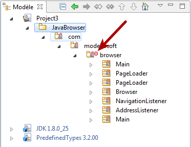
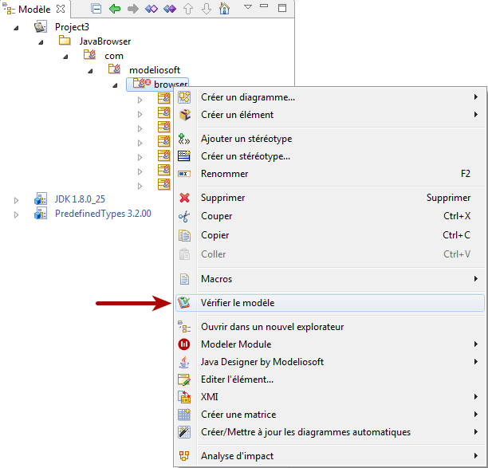
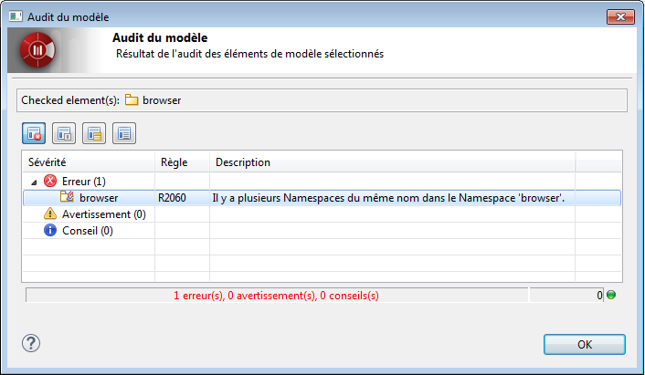
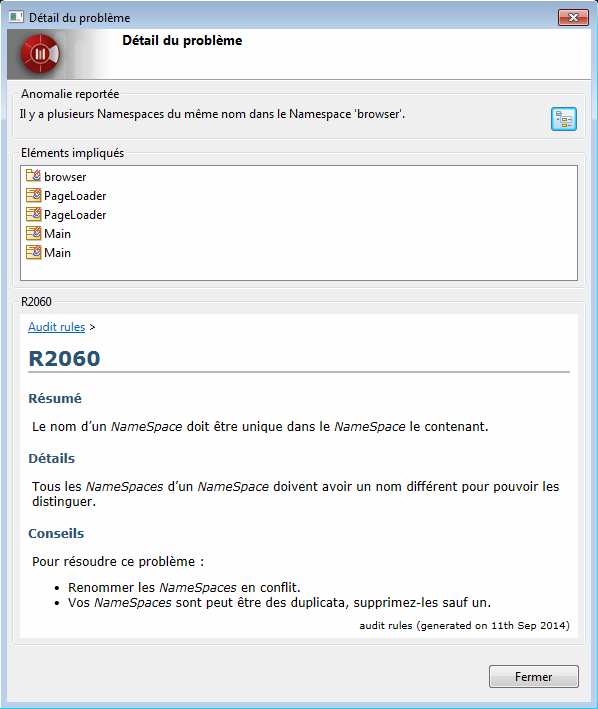

// Disable all captions for figures.
:!figure-caption:
// Path to the stylesheet files
:stylesdir: .

= Audit de modèle Modelio

[[Audit-de-modèle-en-temps-réel]]

[[audit-de-modèle-en-temps-réel]]
===== Audit de modèle en temps réel

L'outil d'audit de Modelio peut analyser le modèle en temps réel. Lorsque des erreurs sont detectées, il ajoute un pictogramme sur chacun des éléments concernés dans la vue modèle :

.Dans l'exemple ci-dessus, l'audit a detecté des erreurs dans le package "browser"

[[La-commande-de-vérification-de-modèle]]

[[la-commande-de-vérification-de-modèle]]
===== La commande de vérification de modèle

Lorsque l'audit signale des erreurs ou des avertissements dans le modèle, vous avez la possibilité d'obtenir les messages d'erreur correspondants en un clic, en exécutant la commande "Vérifier le modèle":

.La commande "Vérifier le modèle"

La commande "Vérifier le modèle" va alors relancer une vérification du modèle pour produire un rapport précis et à jour:

.La fenêtre résultat de la vérification de modèle

En double-cliquant sur l'une des erreurs du rapport, vous obtiendrez une description détaillée de l'erreur ainsi que les conseils pour la corriger.

.La fenêtre Détail du problème

*Note*: Si vous cliquez sur les élemsnts listés dans la fenêtre Détail du problème, Modelio les sélectionnera dans la vue Modèle, ce qui rend plus aisée encore la correction des problèmes.

