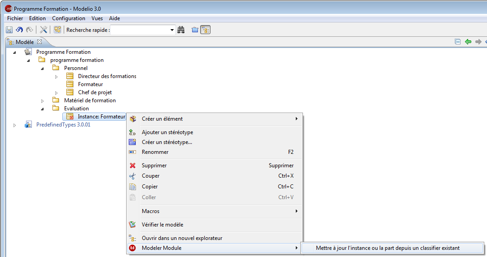

// Disable all captions for figures.
:!figure-caption:

[[Les-assistants-de-modélisation]]

[[les-assistants-de-modélisation]]
= Les assistants de modélisation

[[Introduction]]

[[introduction]]
===== Introduction

Les assistants de modélisation créent des éléments par déduction à partir d'autres éléments, vous permettant ainsi de faire des gains significatifs de productivité, de cohérence et de traçabilité.

Par exemple, à partir d'un objet dans un diagramme de séquence, vous pouvez créer une classe dont les opérations seront déduites directement depuis des messages reçus par l'objet.

Les assistants de modélisation sont activés depuis le menu contextuel "Modeler Module" disponible sur certains éléments dans la vue "Modèle" et dans les diagrammes Modelio.

.Exemple d'assistant de modélisation sur une Instance

[[Assistants-disponibles]]

[[assistants-disponibles]]
===== Assistants disponibles

La liste suivante présente les assistants qui sont disponibles sur les différents éléments de modèle.

*Instance*:

* *Créer un classifier depuis cette instance* : Création d'un classifier et de son contenu à partir de l'instance et des opérations reçues. Si l'instance possède des ports, l'élément créé peut être une classe ou un composant. Sinon, il peut être également une interface ou un nœud.
* *Mettre à jour l'instance ou la part depuis un classifier existant* : Met à jour les ports et les liens d'attributs de l'instance par rapport au classifier instancié. Si l'instance n'est pas liée à un classifier, il est possible de choisir un classifier existant dans le même package que l'instance.

*Ligne de vie*:

* *Créer un classifier depuis cette instance* : Applique l'assistant détaillé ci-dessus sur l'instance représentée par la lifeline. L'instance est également créée si elle n'existait pas.
* *Mettre à jour l'instance ou la part depuis un classifier existant* : Applique l'assistant détaillé ci-dessus sur l'instance représentée par la lifeline. L'instance est également créée si elle n'existait pas.

*Message*:

* *Créer une opération à partir de ce message* : Création d'une opération à partir du message. Si la classe n'existait pas, elle est également créée.

*Lien d'attribut*:

* *Créer un attribut à partir de cette occurrence* : Création d'un attribut à partir du lien d'attribut. Si la classe n'existait pas, elle est également créée.

*Transition*:

* *Créer une opération depuis cette transition* : Création d'une opération à partir de la transition. Cet assistant ne peut être utilisé que dans les diagrammes d'états associés aux classes.

*Interface*:

* *Mettre à jour les classes à partir de cette interface* : Mise à jour de toutes les classes qui implémentent l'interface depuis le contenu de l'interface.

*Classe*:

* *Implémenter les propriétés des interfaces* : Création des opérations définies dans les interfaces qui sont implémentées par la classe sélectionnée.
* *Supprimer l'implémentation des propriétés des interfaces* : Suppression des opérations définies dans les interfaces qui sont implémentées par la classe sélectionnée.
* *Mettre à jour la structure interne* : Mise à jour des parts instanciées dans la structure interne de la classe.

