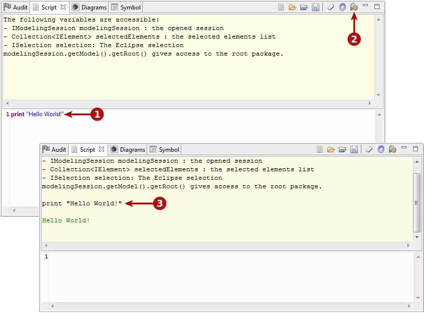
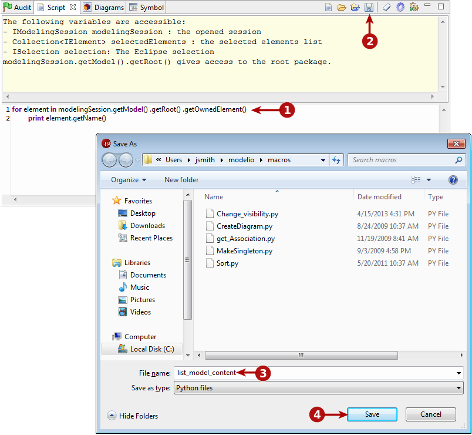

// Disable all captions for figures.
:!figure-caption:

[[Scripts]]

[[scripts]]
= Scripts

[[Introduction]]

[[introduction]]
===== Introduction

Avec Modelio, vous pouvez exécuter les scripts écrits en Jython :

* Soit en ligne de commande Modelio,
* Soit dans une vue dédiée, la vue "Script"

Vous pouvez sauvegarder vos scripts en tant que macros que vous pourrez ensuite réutiliser. Les macros sont définies et organisées dans une fenêtre dédiée. Elles peuvent être lancées à travers une commande de menu contextuel, une icône associée dans la barre d'outils ou bien dans la fenêtre des macros elle-même. Pour plus d'informations, voir la section sur le <<Modeler-_modeler_modelio_settings_macros_catalog.adoc#,catalogue de macros>>.

[[La-vue-ldquoScriptrdquo]]

[[la-vue-script]]
===== La vue "Script"

.La vue "Script"
image::images/Modeler-_modeler_handy_tools_scripts_macros_scripts1.png[2]

*Légende :*

1. Pour ouvrir la vue "Script", lancez la commande "Vues / Script".
2. L'onglet de la vue "Script".
3. La barre d'outils de la vue "Script"(voir ci-dessous).
4. La zone de sortie de la vue "Script".
5. La zone de saisie de la vue "Script".

[[La-barre-doutils-de-la-vue-ldquoScriptrdquo]]

[[la-barre-doutils-de-la-vue-script]]
===== La barre d'outils de la vue "Script"

La barre d'outils de la vue "Script" permet de lancer les opérations suivantes :

* image:images/Modeler-_modeler_handy_tools_scripts_macros_macro_catalog.png[10]: Ouvre le catalogue de macros, où les scripts qui ont été sauvegardés en tant que macros sont présentés.
* image:images/Modeler-_modeler_handy_tools_scripts_macros_load_script.png[11]: Charge un script existant.
* : Charge un script existant et le lance automatiquement.
* image:images/Modeler-_modeler_handy_tools_scripts_macros_save_script.png[13]: Sauvegarde le script saisi dans la zone de saisie dans un fichier.
* image:images/Modeler-_modeler_handy_tools_scripts_macros_clear_content.png[14]: Efface tout le contenu de la zone de sortie de la vue "Script".
* : Active le mode "déboguage" dans la vue "Script". Lorsque ce mode est actif, la zone de saisie ne se vide pas lors de l'exécution d'un script.
* image:images/Modeler-_modeler_handy_tools_scripts_macros_run_in_input.png[16]: Exécute le script saisi dans la zone de saisie et affiche le résultat dans la zone de sortie. Efface la zone de saisie sauf si le mode "déboguage" est actif.

*Note :* Deux raccourcis clavier sont disponibles dans la vue "Script" :

* *Ctrl + Entrée* : Exécute tout ce qui se trouve dans la zone de saisie de la vue "Script".
* *MAJ + Entrée* : N'exécute que ce qui est sélectionné dans la zone de saisie de la vue "Script".

[[Saisir-et-exécuter-des-scripts-Jython]]

[[saisir-et-exécuter-des-scripts-jython]]
===== Saisir et exécuter des scripts Jython

.Saisie et exécution d'un script Jython

*Étapes :*

1. Saisissez votre script dans la zone de saisie de la vue "Script".
2. Cliquez sur l'icône  pour exécuter le script.
3. Le résultat s'affiche immédiatement dans la zone de sortie de la vue "Script".

[[Sauvegarder-un-script-afin-de-le-réutiliser-ultérieurement]]

[[sauvegarder-un-script-afin-de-le-réutiliser-ultérieurement]]
===== Sauvegarder un script afin de le réutiliser ultérieurement

Si vous avez l'intention de réutiliser un script Jython, vous avez la possibilité de le sauvegarder, comme le montre la capture d'écran ci-dessous.

.Enregistrement d'un script Jython

*Étapes :*

1. Saisissez votre script dans la zone de saisie de la vue "Script".
2. Cliquez sur l'icône image:images/Modeler-_modeler_handy_tools_scripts_macros_save_16.png[8] pour sauvegarder le script dans un fichier.
3. Indiquez le nom et le chemin du script.
4. Cliquez sur "Enregistrer".

*Note :* Les scripts qui ont été sauvegardés peuvent être utilisés en tant que macros, disponibles au niveau projet, au niveau espace de travail ou bien au niveau application. Pour plus d'informations, voir la section sur le <<Modeler-_modeler_modelio_settings_macros_catalog.adoc#,catalogue de macros>>.

