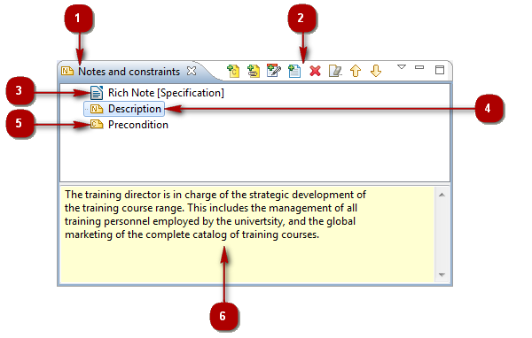
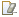

// Disable all captions for figures.
:!figure-caption:

[[La-vue-ldquoNotes-et-contraintesrdquo]]

[[la-vue-notes-et-contraintes]]
= La vue "Notes et contraintes"

.La vue "Notes & contraintes"

*Légende :*

1. L'onglet "Notes & contraintes".
2. La barre d'outils "Notes & contraintes".
3. Une note riche.
4. Une note.
5. Une contrainte.
6. La zone d'édition des notes & contraintes.

[[Principales-commandes-disponibles-dans-la-vue-ldquoNotes-amp-contraintesrdquo]]

[[principales-commandes-disponibles-dans-la-vue-notes-contraintes]]
===== Principales commandes disponibles dans la vue "Notes & contraintes"

*Depuis le menu contextuel dans la vue "Notes & contraintes" :*

* *Supprimer* [image:images/Modeler-_modeler_interface_annot_view_delete.png[3] – Supprimer / Touche *Suppr*] : Supprime la note / contrainte de l'élément sélectionné.
* *Couper* [image:images/Modeler-_modeler_interface_annot_view_cut_16.png[4] – Couper / *Ctrl+X*] : Coupe la note / contrainte de l'élément sélectionné.
* *Copier* [image:images/Modeler-_modeler_interface_annot_view_copy_16.png[5] – Copier / *Ctrl+C*] : Copie la note / contrainte de l'élément sélectionné.
* *Coller* [image:images/Modeler-_modeler_interface_annot_view_paste_16.png[6] – Coller / *Ctrl+V*] : Colle la note / contrainte dans l'élément sélectionné.

*Depuis la barre d'outils de la vue "Notes & contraintes" :*

* *Ajouter une contrainte* [image:images/Modeler-_modeler_interface_annot_view_add_constraint.gif[10]] : Ouvre la fenêtre "Ajouter une contrainte", dans laquelle vous pouvez sélectionner la (les) contrainte(s) que vous souhaitez ajouter à l'élément sélectionné, avant de saisir son (leur) contenu dans la zone de saisie / modification.
* *Ajouter une note* [image:images/Modeler-_modeler_interface_annot_view_add_note.gif[8]] : Ouvre la fenêtre "Ajouter une note", dans laquelle vous pouvez sélectionner la(les) note(s) que vous souhaitez ajouter à l'élément sélectionné, avant de saisir son (leur) contenu dans la zone de saisie / modification.
* *Ajouter une description* [] : Ajoute une note de type "description" et permet à l'utilisateur de saisir son contenu dans la zone de saisie / modification.
* *Ajouter une note riche* [ – Ajouter une note riche...] : Ouvre la fenêtre "Création d'une note riche", dans laquelle vous pouvez définir le nom, le rôle, le format MIME et l'abstract de la note riche que vous souhaitez ajouter à l'élément sélectionné, avant d'ouvrir l'éditeur correspondant.
* *Supprimer* [image:images/Modeler-_modeler_interface_annot_view_delete.png[3] / Touche *Suppr*] : Supprime la note / contrainte de l'élément sélectionné.
* *Vider la note / contrainte* [] : Supprime le contenu de la note ou contrainte sélectionnée, mais pas la note ou contrainte elle-même.
* *Déplacer vers le haut* [] : Déplace l'élément sélectionné vers le haut dans la structure du modèle.
* *Déplacer vers le bas* [] : Déplace l'élément sélectionné vers le bas dans la structure du modèle.

*Note :* Pour plus d'informations, voir "<<Modeler-_modeler_building_models_add_notes.adoc#,Ajouter des notes aux éléments>>" et "<<Modeler-_modeler_building_models_add_richnotes.adoc#,Ajouter des notes riches aux éléments>>".

