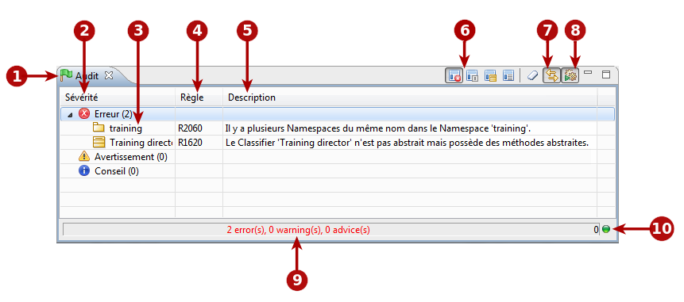
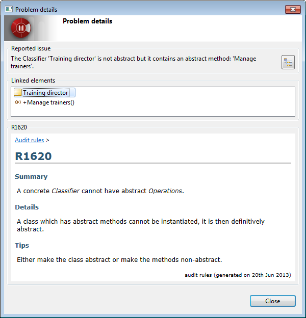

// Disable all captions for figures.
:!figure-caption:
// Path to the stylesheet files
:stylesdir: .

[[La-vue-ldquoAuditrdquo]]

[[la-vue-audit]]
= La vue "Audit"

.La vue Audit

*Légende :*

1. L'onglet "Audit". Le drapeau à gauche de cet onglet change de couleur selon le problème le plus grave actuellement détecté.
** Vert : Aucun problème détecté.
** Bleu : Le problème le plus grave actuellement détecté est un problème de niveau "conseil".
** Jaune : Le problème le plus grave actuellement détecté est un problème de niveau "avertissement".
** Rouge : Le problème le plus grave actuellement détecté est un problème de niveau "erreur".
2. La sévérité de la règle d'audit. Il existe trois niveaux de sévérité :
** Conseil : Simple message d'information.
** Avertissement : Vous pouvez choisir de tenir cette information en compte ou pas.
** Erreur : Le problème doit être réglé.
3. Principal élément concerné.
4. Numéro de la règle d'audit.
5. Description du problème.
6. Options d'affichage des règles d'audit.
7. Auto-sélection de l'élément concerné dans l'explorateur de modèle.
8. Bouton de mode d'exécution de l'audit.
9. Résumé de l'audit courant. Ceci indique combien de problèmes de type "conseil", "avertissement" et "erreur" sont actuellement ouverts.
10. Statut de l'audit. Un feu vert indique que l'audit n'est pas en train de s'exécuter, tandis qu'un feu rouge indique que l'audit tourne actuellement.

[[Principaux-services-de-la-vue-ldquoAuditrdquo]]

[[principaux-services-de-la-vue-audit]]
===== Principaux services de la vue "Audit"

*Depuis la barre d'outil de la vue "Audit" :*

* *Afficher par sévérité* [image:images/Modeler-_modeler_interface_audit_view_LayoutByType.png[8]] : Affiche les problèmes d'audit selon leur sévérité (erreur, avertissement, conseil).
* *Afficher par règle* [] : Affiche les problèmes d'audit par règle. Toutes les violations d'une règle donnée sont affichées ensemble.
* *Afficher par élément concerné* [] : Affiche les problèmes d'audit par élément concerné. Toutes les violations concernant un élément donné sont affichées ensemble.
* *Afficher à plat* [] : Affiche les violations des règles d'audit simplement dans l'ordre dans lequel elles ont été détectées.
* *Effacer le contenu de la fenêtre d'audit* [image:images/Modeler-_modeler_interface_audit_view_clear.png[5]] : Effacer le contenu de la fenêtre d'audit.
* *Sélection automatique de l'élément concerné dans l'explorateur* [image:images/Modeler-_modeler_interface_audit_view_autoselect.png[4]] : Lorsque cette option est active, l'explorateur de modèle "suit" vos sélections dans la fenêtre de l'audit et sélectionne automatiquement l'élément concerné dans l'explorateur de modèle.
* *Mode d'exécution de l'audit* [image:images/Modeler-_modeler_interface_audit_view_auto.png[3]] : Lorsque vous appuyez sur ce bouton, le mode d'exécution automatique est activé. Sinon, le mode manuel est activé. En mode automatique, l'audit analysera automatiquement chaque modification effectuée dans le modèle. En mode manuel, les vérifications ne sont faites que sur demande, en lançant la commande "Vérifier le modèle" depuis un élément de modèle (depuis le menu contextuel en cliquant droit sur un élément de modèle). A noter qu'en mode manuel, la commande "Vérifier le modèle" ne vérifie que l'élement sélectionné et non pas le modèle entier.

*Depuis le menu contextuel de la vue "Audit" :*

* *Sélectionner dans l'explorateur* : Cette commande vous permet de sélectionner l'élément impliqué dans la violation de la règle d'audit dans l'explorateur de modèle. Cette commande n'est utile que si l'option "Auto-sélection de l'élément concerné dans l'explorateur de modèle" a été desactivée en utilisant le bouton [image:images/Modeler-_modeler_interface_audit_view_autoselect.png[4]] dans la barre d'outils de la fenêtre d'audit.
* *Voir les détails* : Cette commande ouvre la fenêtre "Détails du problème" qui fournit des informations détaillés sur le problème rencontré. Pour plus d'informations, voir le paragraphe *La fenêtre "Détails du problème"* ci-dessous.
* *Changer la sévérité* : Les trois commandes "Changer la sévérité" ("Changer la sévérité en conseil", "Changer la sévérité en avertissement" et "Changer la sévérité en erreur") vous permettent de changer la sévérité de la règle d'audit sélectionnée.
* *Désactiver la règle* : Cette commande vous permet de désactiver la règle sélectionnée. La règle en question ne s'appliquera plus à votre modèle. Si vous souhaitez réactiver la règle, vous pouvez le faire en utilisant le "Configurateur de l'audit".

[[La-fenêtre-ldquoDétails-du-problèmerdquo]]

[[la-fenêtre-détails-du-problème]]
===== La fenêtre "Détails du problème"

.La fenêtre "Détails du problème

*Légende :*

* Le champ *Anomalie reportée* rappelle la règle d'audit qui a été violée.
* Le champ *Eléments impliqués* donne des informations sur d'autres éléments impliqués dans la violation de la règle d'audit. Par exemple, pour les cycles de dépendance, la fenêtre affichera tous les éléments impliqués dans le cycle.
* La *Zone d'information* affiche des informations supplémentaires sur le problème, et vous donne des conseils sur comment le résoudre.

