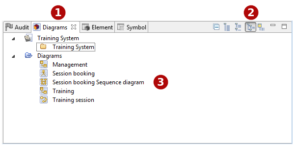

// Disable all captions for figures.
:!figure-caption:

[[La-vue-ldquoDiagrammesrdquo]]

[[la-vue-diagrammes]]
= La vue "Diagrammes"

.La vue "Diagrammes" en mode "Afficher par groupes utilisateurs"

*Légende :*

1. L'onglet "Diagrammes".
2. La barre d'outils de la vue "Diagrammes".
3. Les diagrammes.

[[Principales-commandes-disponibles-dans-la-vue-ldquoDiagrammesrdquo]]

[[principales-commandes-disponibles-dans-la-vue-diagrammes]]
===== Principales commandes disponibles dans la vue "Diagrammes"

*Depuis le menu contextuel disponible sur des éléments dans la vue "Diagrammes" :*

* *Créer un dossier* [ – Créer un dossier] : Crée un dossier utilisateur sous l'élément sélectionné.
* *Supprimer un élément* [image:images/Modeler-_modeler_interface_diagrams_view_delete.png[5] – Supprimer / Touche *Suppr*] : Supprime l'élément sélectionné.
* *Renommer un élément* [image:images/Modeler-_modeler_interface_diagrams_view_rename.png[6] – Renommer / Touche *F2*] : Renomme l'élément sélectionné.

*Depuis la barre d'outils de la vue "Diagrammes" :*

* *Réduire tout* [image:images/Modeler-_modeler_interface_diagrams_view_collapse_all.gif[7]] : Réduit tous les éléments et ne montre que la racine du projet.
* *Afficher à plat* [] : Liste les diagrammes à plat.
* *Afficher par type de diagrammes* [image:images/Modeler-_modeler_interface_diagrams_view_bytype_browser16.png[9]] : Affiche les diagrammes dans les dossiers selon leur type.
* *Afficher par groupes utilisateur* [] : Afficher les raccourcis diagrammes dans les dossiers créés par l'utilisateur.
* *Afficher par propriétaire* [] : Affiche les diagrammes sous leur propriétaire.

*Note :* Pour plus d'informations, voir "<<Modeler-_modeler_diagrams_creating_diagram.adoc#,Créer un diagramme>>" et "<<Modeler-_modeler_diagrams_opening_diagram.adoc#,Ouvrir un diagramme>>".

