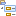

// Disable all captions for figures.
:!figure-caption:

[[La-vue-ldquoEdition-des-diagrammesrdquo]]

[[la-vue-edition-des-diagrammes]]
= La vue "Edition des diagrammes"

.La vue "Edition des diagrammes"
image::images/Modeler-_modeler_interface_edition_view_DiagramEditionViewPuces.png[2]

*Légende :*

1. Nom du diagramme.
2. Palette du diagramme.
3. Groupe de palette étendu.
4. Groupe de palette réduit.
5. Barre d'outil du diagramme.
6. <<Modeler-_modeler_interface_symbol_view.adoc#,Vue symbole>> réduite.

[[Principales-commandes-disponibles-dans-la-vue-ldquoEdition-des-diagrammesrdquo]]

[[principales-commandes-disponibles-dans-la-vue-edition-des-diagrammes]]
===== Principales commandes disponibles dans la vue "Edition des diagrammes"

*Depuis la palette du diagramme :*

* *Créer un élément* [Icône de palette de votre choix] : Crée l'élément correspondant à l'icône de palette sélectionnée dans le diagramme.

*Depuis la barre d'outils du diagramme :*

* *Masquer* [image:images/Modeler-_modeler_interface_edition_view_mask.png[17]] : Masque le(s) élément(s) de votre choix.
* *Activer / Désactiver la grille* [image:images/Modeler-_modeler_interface_edition_view_grid.png[4]] : Affiche ou cache la grille dans le diagramme, afin de faciliter l'alignement des éléments.
* *Cloner les options graphiques* [image:images/Modeler-_modeler_interface_edition_view_clone_graphic_options.gif[5]] : Clone les options graphiques définies pour un élément sélectionné, afin de les appliquer à un autre élément dans le diagramme.
* *Aligner les éléments* [] : La barre d'outils du diagramme contient plusieurs icônes d'alignement, parmi lesquelles vous pouvez choisir la manière dont vous souhaitez aligner les éléments sélectionnés.
* *Retaillage automatique* [image:images/Modeler-_modeler_interface_edition_view_auto_size.png[7]] : Retaille automatiquement le ou les élément(s) sélectionné(s).
* *Copier le diagramme en tant que graphique* [] : Copie le contenu du diagramme dans le presse-papier..
* *Sauvegarder le diagramme dans un fichier* [image:images/Modeler-_modeler_interface_edition_view_save_image.png[9]] : Ouvre la fenêtre "Enregistrer sous", dans laquelle vous pouvez configurer la sauvegarde de votre diagramme dans un fichier.
* *Imprimer le diagramme* [image:images/Modeler-_modeler_interface_edition_view_print.png[10]] : Imprime le contenu du diagramme.
* *Dézoomer* [image:images/Modeler-_modeler_interface_edition_view_zoom_out.png[11]] : Effectue un zoom arrière sur l'intégralité du diagramme.
* *Echelle 1:1* [] : Afficher le contenu du diagramme à sa taille standard (à l'échelle 1:1).
* *Zoomer* [image:images/Modeler-_modeler_interface_edition_view_zoom_in.png[13]] : Effectue un zoom avant sur l'intégralité du diagramme.

*Depuis les menus contextuels dans un diagramme :*

* *Créer un élément* [image:images/Modeler-_modeler_interface_edition_view_createuml.png[14] – Créer un élément] : Crée l'élément de votre choix dans l'élément sélectionné.
* *Ajouter un stéréotype* [image:images/Modeler-_modeler_interface_edition_view_addStereotype_16.png[15] – Ajouter un stéréotype...] : Ajoute un ou plusieurs stéréotypes à l'élément sélectionné.
* *Renommer* [ – Renommer / *F2*] : Edite le nom de l'élément sélectionné.
* *Sélectionner dans l'explorateur* [ – Sélectionner dans l'explorateur / *Ctrl-Entrée*] : Sélectionne l'élément dans la vue "Modèle".
* *Editer l'élément...* [image:images/Modeler-_modeler_interface_edition_view_openproperties.png[21] – Editer l'élément...] : Ouvre la <<Modeler-_modeler_building_models_editing_elements.adoc#,boite d'édition>> de l'élément sélectionné.
* *Masquer un élément* [image:images/Modeler-_modeler_interface_edition_view_mask.png[17] – Masquer la sélection / *Ctrl-M*] : Masque le ou les élément(s) sélectionné(s).
* *Supprimer un élément* [image:images/Modeler-_modeler_interface_edition_view_delete_16.png[18] – Supprimer la sélection / *Suppr*] : Supprime le ou les élément(s) sélectionné(s).
* *Démasquer* [Démasquer] : Démasque le ou les élément(s) de votre choix .

*Note :* Pour plus d'informations, voir "<<Modeler-_modeler_diagrams_creating_elements.adoc#,Créer des éléments dans un diagramme>>" et plus généralement toutes les pages du chapitre "Diagrammes Modelio".

