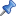
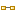
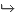
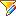
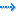

// Disable all captions for figures.
:!figure-caption:
// Path to the stylesheet files
:stylesdir: .

= La vue "Editeur de liens"

.La vue "Editeur de liens"
image::images/Modeler-_modeler_interface_linkeditor_view_vue_editeur_liens.png[2]

===== Principales commandes dans la vue "Editeur de liens"

*Depuis la barre d'outils située en haut de l'éditeur de liens :*

* *Accrocher / Libérer l'élément sélectionné pour édition* [] : Change l'éditeur de liens du mode "Edition" en mode "Visualisation" et vice versa.
* *Copier en tant que graphique* [image:images/Modeler-_modeler_interface_linkeditor_view_copy_image.png[8]] : Copie le contenu de l'éditeur de liens dans le press-papier.
* *Enregistrer dans un fichier* [image:images/Modeler-_modeler_interface_linkeditor_view_save_image.png[9]] : Ouvre la fenêtre "Enregistrer sous", dans laquelle vous pouvez configurer l'enregistrement du contenu de l'éditeur de liens dans un fichier.
* *Imprimer* [image:images/Modeler-_modeler_interface_linkeditor_view_print.png[10]] : Imprime le contenu de l'éditeur de liens.
* *Dézoomer* [image:images/Modeler-_modeler_interface_linkeditor_view_zoom_out.png[11]] : Effectue un zoom arrière sur le contenu de l'éditeur de liens.
* *Echelle 1:1* [image:images/Modeler-_modeler_interface_linkeditor_view_zoom_to_default.png[12]] : Affiche le contenu de l'éditeur de liens à sa taille standard (à l'échelle 1:1).
* *Zoomer* [image:images/Modeler-_modeler_interface_linkeditor_view_zoom_in.png[13]] : Effectue un zoom avant sur le contenu de l'éditeur de liens.

*Depuis le menu "Vue" de l'éditeur de liens :*

* *Disposition horizontale* [] : Affiche les liens et les éléments horizontalement.
* *Disposition verticale* [image:images/Modeler-_modeler_interface_linkeditor_view_Vertical_Orientation.png[16]] : Affiche les liens et les éléments horizontalement.
* *Disposition automatique* [image:images/Modeler-_modeler_interface_linkeditor_view_Automatic_Orientation.png[17]] : Affiche les liens et les éléments selon les types de liens à afficher.

*Depuis la barre d'outils située en bas de l'éditeur de liens :*

* *Afficher/Créer les héritages* [image:images/Modeler-_modeler_interface_linkeditor_view_generalization.png[18]] : Lorsque ce bouton est activé, les liens d'héritage sont affichés. Si l'éditeur est en mode "Edition", un lien d'héritage sera créé lorsqu'un élément est glissé-déposé dans l'éditeur de liens.
* *Afficher/Créer les associations* [] : Lorsque ce bouton est activé, les Associations sont affichées. Si l'éditeur est en mode "Edition", une Association sera créée lorsqu'un élément est glissé-déposé dans l'éditeur de liens.
* *Afficher/Créer les Element Imports* [image:images/Modeler-_modeler_interface_linkeditor_view_elementimport.png[20]] : Lorsque ce bouton est activé, les Element Imports sont affichés. Si l'éditeur est en mode "Edition", un Element Import sera créé lorsqu'un élément est glissé-déposé dans l'éditeur de liens.
* *Afficher/Créer les liens de traçabilité* [image:images/Modeler-_modeler_interface_linkeditor_view_traceability.png[24]] : Lorsque ce bouton est activé, les liens de traçabilité sont affichés. Si l'éditeur est en mode "Edition", un lien de traçabilité sera créée lorsqu'un élément est glissé-déposé dans l'éditeur de liens.
* *Afficher/Créer les Dépendances* [image:images/Modeler-_modeler_interface_linkeditor_view_dependency.png[21]] : Lorsque ce bouton est activé, les liens de dépendances sont affichés. Si l'éditeur est en mode "Edition", une dépendance sera créée lorsqu'un élément est glissé-déposé dans l'éditeur de liens.
* *Filtrer les Dépendances* [image:images/Modeler-_modeler_interface_linkeditor_view_Filter.png[22]] : Lorsque ce bouton est activé, l'affichage / la création des dépendances s'effectue selon le filtrage des dépendances.
* *Définir le filtrage des Dépendances* [] : Permet la configuration du filtrage des dépendances à travers la sélection des dépendances stéréotypées qui seront affichées / créées.
* *Afficher les NamespaceUses* [] : Lorsque ce bouton est activé, les NamespaceUses sont affichés.
* *Nombre de niveaux affichés en aval* : Définit le nombre d'éléments liés qui seront affichés en aval de l'élément sélectionné.
* *Nombre de niveaux affichés en amont* : Définit le nombre d'éléments liés qui seront affichés en amont de l'élément sélectionné.

*Note :* Pour plus d'informations, voir "<<Modeler-_modeler_building_models_creating_links_linkeditor.adoc#,Créer des liens dans l'éditeur de liens>>".

