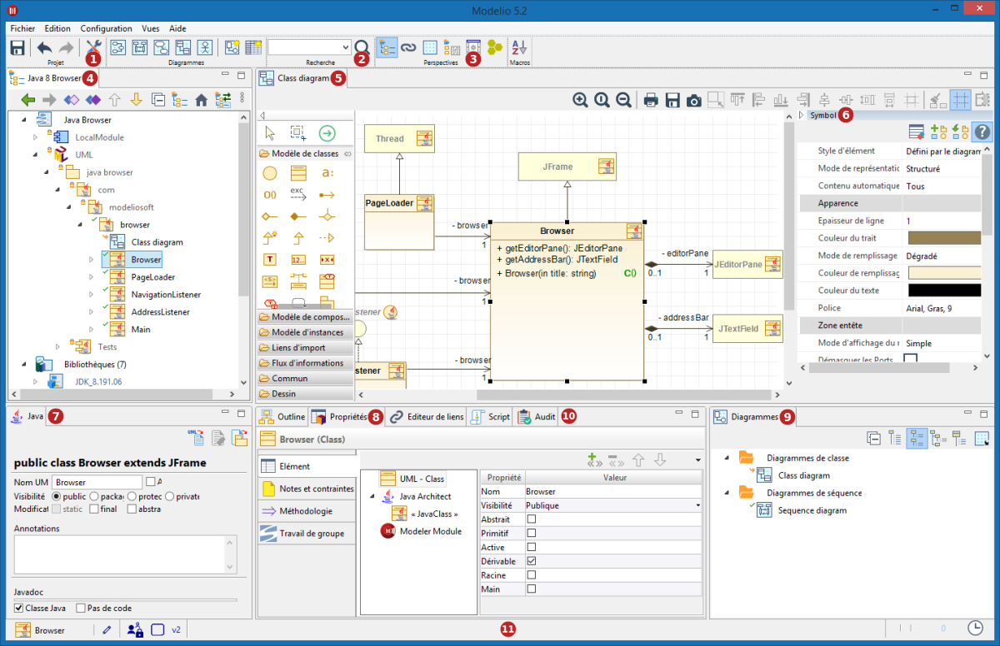

// Disable all captions for figures.
:!figure-caption:
// Path to the stylesheet files
:stylesdir: .

= La fenêtre principale

.La fenêtre principale de Modelio

*Légende :*

. L'outil de <<Modeler-_modeler_managing_projects_configuring_project_informations.adoc#,configuration du projet>>. Cet outil vous permet de configurer les informations, les modèles de travail, les bibliothèques, les modules, l'audit et les URLs pour votre project.
. L'<<Modeler-_modeler_handy_tools_advanced_search.adoc#,outil de recherche avancée>>. Cet outil recherche des éléments de type "NameSpace" à partir d'un nom complet ou partiel.
. Les boutons de perspectives. Ces icônes vous permettent de changer de perspective (<<Modeler-_modeler_interface_workspace_view.adoc#,Espace de travail>> ou <<Modeler-_modeler_interface_uml_view.adoc#,modèle>>).
. La vue <<Modeler-_modeler_interface_uml_view.adoc#,"Modèle">>. Dans cette vue, vous pouvez visualiser, parcourir et éditer votre modèle UML / BPMN.
. La vue <<Modeler-_modeler_interface_edition_view.adoc#,"Edition de diagrammes">>. Dans cette vue, vous pouvez visualiser et éditer votre modèle sous forme de diagrammes.
. La vue <<Modeler-_modeler_diagrams_graphic_options.adoc#,"Symbole">>. Dans cette vue, vous pouvez visualiser et éditer les propriétés graphiques de vos diagrammes.
. L'onglet "Modules". Dans cette vue, vous pouvez visualiser et éditer les options apportées par les <<Modeler-_modeler_managing_projects_configuring_project_modules.adoc#,modules>> (dans cet exemple, par le module "Java Designer").
. La vue <<Modeler-_modeler_building_models_modifying_element_props.adoc#,"Propriétés">>. Dans cette vue, vous pouvez ajouter ou supprimer des stéréotypes ou des tagged values, et visualiser et éditer les propriétés UML d'un élément sélectionné dans les vues de navigation ou d'édition.
. La vue <<Modeler-_modeler_interface_diagrams_view.adoc#,"Diagrammes">>. Dans cette vue, vous pouvez visualiser, parcourir et trier vos diagrammes.
. Autres vues. <<Modeler-_modeler_handy_tools_scripts_macros.adoc#,Script>>, <<Modeler-_modeler_building_models_creating_links_linkeditor.adoc#,Editeur de liens>>, <<Modeler-_modeler_interface_audit_view.adoc#,Audit>>, <<Modeler-_modeler_interface_outline_view.adoc#,Outline>>...
. La <<Modeler-_modeler_interface_status_bar.adoc#,barre d'état>> de l'application.

*Note :* Toutes les vues de la fenêtre principale de Modelio sont dockables et peuvent être positionnées à l'endroit de votre choix dans la fenêtre principale de Modelio. Utilisez le menu "Vues" pour sélectionner les vues que vous souhaitez afficher.

