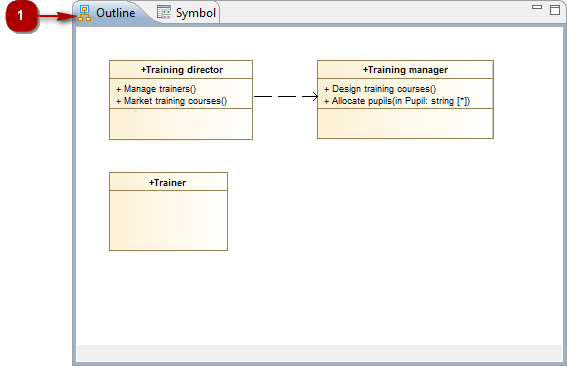

// Disable all captions for figures.
:!figure-caption:
// Path to the stylesheet files
:stylesdir: .

= La vue "Outline"

.La vue "Outline"

*Légende :*

1. Onglet "Outline".

La vue "Outline" représente votre diagramme en miniature, vous fournissant ainsi une vue globale de votre diagramme dans son intégralité.

La vue "Outline" vous permet également de voir quels éléments sont actuellement visiblement dans la vue "Edition de diagrammes", et quels éléments ne le sont pas (car ils se trouvent en dehors de la zone montrée dans la vue "Edition de diagrammes"). La partie du diagramme qui est visible dans la vue "Edition de diagrammes" est affichée dans un cadre au fond gris dans la vue "Outline", tandis que la (les) partie(s) cachée(s) est affichée dans un cadre au fond blanc.

