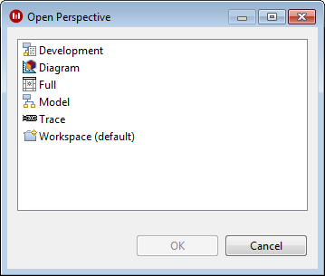
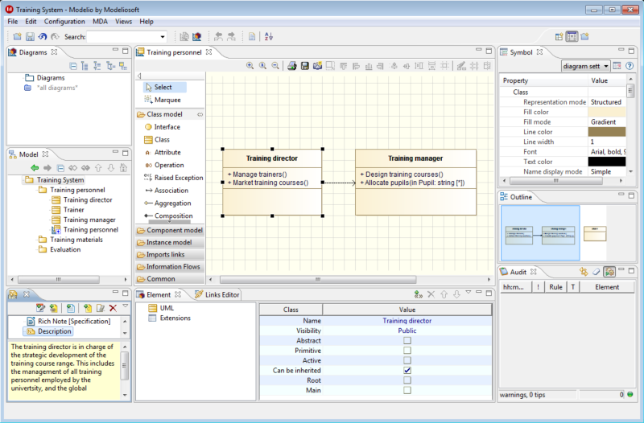
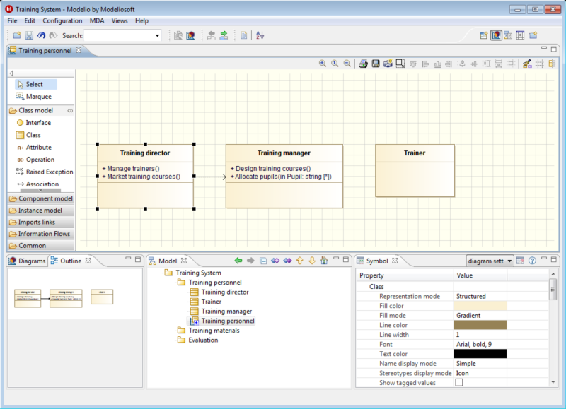
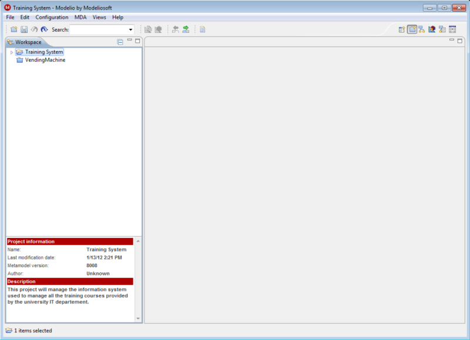

// Disable all captions for figures.
:!figure-caption:
// Path to the stylesheet files
:stylesdir: .

= Les perspectives

=== Qu'est-ce que les perspectives ?

Une perspective définit les vues affichées dans Modelio, ainsi que leur disposition, fournissant ainsi un moyen d'organisation supplémentaire lors de l'interaction avec un modèle. Les utilisateurs peuvent changer de perspectives selon la tâche en cours. Modelio propose plusieurs perspectives, chacune élaborée pour répondre aux besoins d'un ensemble de tâches particulier.

*Note :* Vous avez toujours la possibilité d'ouvrir, de fermer, de retailler et de déplacer des vues manuellement.

.Changer de perspective

=== Perspective Complète

Cette perspective affiche la plupart des vues, fournissant ainsi une vue globale de toutes les fonctionnalités disponibles.

=== Perspective Modèle

image::images/Modeler-_modeler_interface_perspectives_PerpectiveModel.png[4]

La perspective modèle a été conçue pour la modélisation pure et détaillée. Les propriétés et annotations d'un élément sont rapidement accessibles, ainsi que la vue "Audit", qui vous aidera à construire un meilleur modèle. Dans cette perspective, les diagrammes sont un moyen de créer et de visualiser les éléments de modèle, mais ils ne sont pas l'élément principal.

=== Perspective Diagramme

Cette perspective présente une zone d'édition de diagrammes de taille importante, afin de faciliter la création et l'édition des diagrammes. Utilisez la explorateurs de diagrammes ou de modèle pour trouver les diagrammes qui vous intéressent, puis regardez une vue globale de leur contenu dans la vue "Outline". La vue "Symbole" joue également un rôle important dans cette perspective, vous permettant d'éditer facilement les propriétés graphiques des éléments de vos diagrammes.

=== Perspective Trace

image::images/Modeler-_modeler_interface_perspectives_PerspectiveTrace.png[6]

Cette perspective se concentre sur le parcours rapide de liens. Vous vous interrogez sur l'arbre d'héritage d'un élément, ou bien vous voulez savoir quels cas d'utilisation sont tracés ? Et bien, la perspective trace est la perspective qu'il vous faut !

=== Perspective Développement

image::images/Modeler-_modeler_interface_perspectives_PerspectiveDevelopment.png[7]

La perspective développement se concentre sur le travail avec des modules, tels que des générateurs de code. Les éditeurs occupent une large partie de l'application, ainsi que les propriétés des éléments et des propriétés spécifiques aux modules.

=== Perspective Projets

La perspective projets montre tous les projets dans votre espace de travail courant. Dans cette perspective, vous pouvez créer, supprimer, importer, exporter et renommer vos projets. Vous pouvez également vérifier si un projet est verrouillé (et si oui, qui le verrouille), si le modèle d'un projet a besoin d'être migré avant utilisation, et ainsi de suite.

La perspective projets est utilisée par défaut lorsqu'aucun projet n'est ouvert (c'est à dire, lors du lancement de Modelio, après la fermeture d'un projet, et ainsi de suite). Elle est automatiquement remplacée lorsqu'un projet est ouvert.

