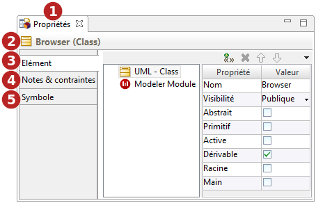

// Disable all captions for figures.
:!figure-caption:
// Path to the stylesheet files
:stylesdir: .

[[La-vue-Propriétés]]

[[la-vue-propriétés]]
= La vue Propriétés

La vue *Propriétés* est une vue combinée agrégeant les vues *<<Modeler-_modeler_interface_uml_prop_view.adoc#,Elément>>*, *<<Modeler-_modeler_interface_annot_view.adoc#,Notes & contraintes>>*

et *<<Modeler-_modeler_interface_symbol_view.adoc#,Symbole>>*.

.La vue Propriétés

*Légende :*

1. Onglet de la vue *"Propriétés"*.
2. Nom et métaclasse de l'élément sélectionné.
3. Onglet "<<Modeler-_modeler_interface_uml_prop_view.adoc#,Elément>>".
4. Onglet "<<Modeler-_modeler_interface_annot_view.adoc#,Notes & contraintes>>".
5. Onglet "<<Modeler-_modeler_interface_symbol_view.adoc#,Symbole>>".

