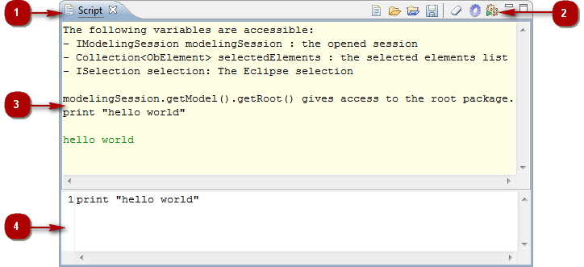

// Disable all captions for figures.
:!figure-caption:
// Path to the stylesheet files
:stylesdir: .

[[La-vue-ldquoScriptrdquo]]

[[la-vue-script]]
= La vue "Script"

.La vue "Script"

*Légende :*

1. L'onglet "Script".
2. La barre d'outils "Script".
3. La zone d'entrée du script.
4. La zone de sortie du script.

[[Principales-commandes-disponibles-dans-la-vue-ldquoScriptrdquo]]

[[principales-commandes-disponibles-dans-la-vue-script]]
===== Principales commandes disponibles dans la vue "Script"

* *Ouvrir le catalogue de macros* [image:images/Modeler-_modeler_interface_script_view_scriptcatalog.png[10]] : Ouvre le catalogue de macros.
* *Charger un fichier script* [image:images/Modeler-_modeler_interface_script_view_loadfile_16.png[5]] : Charge un script existant.
* *Charger et exécuter un fichier script* [image:images/Modeler-_modeler_interface_script_view_runfile_16.png[6]] : Charge un script exécutant et le lance automatiquement.
* *Sauvegarder le script dans un fichier* [] : Sauvegarde le script saisi dans la zone d'entrée dans un fichier.
* *Effacer le contenu de la zone de sortie* [image:images/Modeler-_modeler_interface_script_view_clearoutput_16.png[4]] : Efface tout le contenu de la zone de sortie de la vue "Script".
* *Activer le mode "déboguage de scripts"* [image:images/Modeler-_modeler_interface_script_view_debugmode_16.png[8]] : Active le mode "déboguage" dans la vue "Script". Lorsque ce mode est actif, la zone d'entrée ne se vide pas lors de l'exécution d'un script.
* *Exécuter un script* [image:images/Modeler-_modeler_interface_script_view_go_16.png[3]] : Exécute le script saisi dans la zone d'entrée et affiche le résultat dans la zone de sortie.

*Note :* Pour plus d'informations, voir "<<Modeler-_modeler_handy_tools_scripts_macros.adoc#,Scripts et macros>>".

