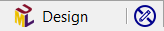
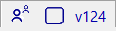
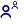
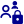
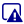
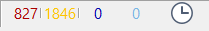

// Disable all captions for figures.
:!figure-caption:
// Path to the stylesheet files
:stylesdir: .

= Barre d'état

La barre d'était montre un résumé rapide de différents aspects de l'application.

===== Etat de l'élément

. Icone principale de l'élément sélectionné.
. Nom de l'élément sélectionné.
. Editabilité de l'élément sélectionné :
*  L'élément peut être édité librement.
*  L'élément n'est pas modifiable.

===== Etat SVN

. Etat du verrouillage dans le référentiel :
*  L'élément n'est pas verrouillé.
*  L'élément est verrouillé par l'utilisateur connecté.
*  L'élément est verrouillé par un autre utilisateur.
*  L'élément n'est pas versionné.
. Etat de l'élément par rapport au référentiel :
*  L'élément est inchangé.
*  L'élément a été modifié localement.
*  L'élément est prêt à être ajouté au référentiel.
*  L'élément est prêt à être enlevé du référentiel.
*  L'élément a été modifié dans le référentiel, une mise à jour du modèle est peut-être nécessaire.
*  L'élément est en conflit : il a été modifié localement et dans le référentiel. Utiliser la résolution de conflit SVN pour le réparer.
. Numéro de révision dans le référentiel.

===== Etat de l'audit

Résumé de l'état de l'audit dans l'application.

. Ceci indique le nombre d'erreurs, avertissements et conseils indiqués par l'audit dans le projet. Ouvrir la <<Modeler-_modeler_interface_audit_view.adoc#,vue audit>> pour les voir.
. Nombre de test restant à traiter, après une modification du modèle.
. Indique si l'audit est actif ou non.
