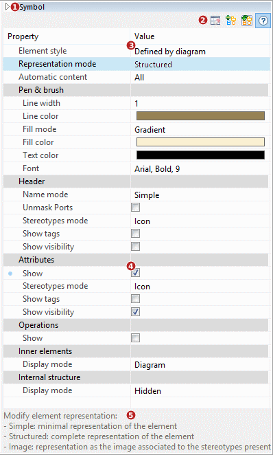

// Disable all captions for figures.
:!figure-caption:
// Path to the stylesheet files
:stylesdir: .

[[La-vue-ldquoSymbolerdquo]]

[[la-vue-symbole]]
= La vue "Symbole"

.La vue "Symbole"

*Légende :*

1. Afficher/cacher la vue "Symbole".
2. Barre d'outils "Symbole".
3. Propriétés de l'élément principal.
4. Propriétés des sous-éléments.
5. Champs d'aide.

*Note :* Pour plus de détails, voir "<<Modeler-_modeler_diagrams_graphic_options.adoc#,Définir les options graphiques dans les diagrammes>>".

